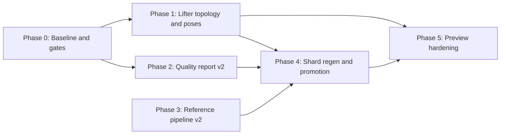

# Geometry lift assembly parity — multi-phase roadmap

**Status:** Planning (multitask-ready)  
**Pinned version:** 26.1.2 (`minecraft-26.1.2-client.jar`)  
**Trigger:** Models in the [pilot JVM set](generated/geometry-assembly-parity-pilots-26.1.2.txt) (e.g. `CreeperModel` as canary) report `ok` with all three `reference*Match: true` in [`geometry-lift-quality-26.1.2.json`](generated/geometry-lift-quality-26.1.2.json), yet Explore 3D preview shows wrong assembly (e.g. legs above head).

**Related docs:** [`generated/geometry-ir-conventions.md`](generated/geometry-ir-conventions.md), [`test-guidance-geometry-animation-ir.md`](test-guidance-geometry-animation-ir.md), [`vanilla-preview-parity.md`](vanilla-preview-parity.md), [`generated/geometry-assembly-parity-pilots-26.1.2.txt`](generated/geometry-assembly-parity-pilots-26.1.2.txt)

---

## Program scope

This program targets **all affected entity models** on 26.1.2, not a creeper-only fix.

| Scope layer | What it covers |
|-------------|----------------|
| **Pilot JVM set** | [`geometry-assembly-parity-pilots-26.1.2.txt`](generated/geometry-assembly-parity-pilots-26.1.2.txt) — **56 JVMs** (union of `prioritizedBacklogJvmNames` + must-fix quadruped/monster pilots) |
| **Backlog driver** | `prioritizedBacklogJvmNames` in [`geometry-lift-quality-26.1.2.json`](generated/geometry-lift-quality-26.1.2.json): models with `suspectedFlatNestedPartCount > 0` while `reference*Match` stay true |
| **Family fixes** | Quadruped / humanoid-adjacent rigs per [Appendix B](#appendix-b--models-likely-affected-non-exhaustive) — lifter and gate changes apply by **pattern**, not per-model hacks |
| **Regression canary** | `CreeperModel` — smallest documented false-green; use for T0 tests and manual Explore checks, not as the only promotion target |

**Creeper is the canonical *example*** in tables and agent briefs below. Phase deliverables and exit criteria refer to the **pilot JVM set** or **all `ok` shards matching pattern X** unless a brief explicitly names the canary.

---

## Executive summary

Current lift-quality checks validate **IR ↔ `reference_java` local agreement** (cuboids by part id, local poses, sorted cuboid fingerprint multiset). They do **not** validate **composed world layout** or **vanilla `javap` ground truth**.

The creeper failure mode is representative of a **class** of quadruped / humanoid-adjacent rigs:

| Gap | Symptom | Example (creeper) |
|-----|---------|---------------------|
| Flat part tree (no `addOrReplaceChild` edges) | Parts composed from `root` only; body rotation does not affect legs | `suspectedFlatNestedPartCount: 4` when report is fresh |
| Wrong `PartPose` kind or values vs factory | Flat tree + wrong locals; preview applies clean-room rotation creeper jar lacks | Body `T(0,6,0)` offset-only in jar vs template `T(0,5,2)+Rx(π/2)` |
| Preview repair without pose rebase | `GeometryIrPartTreeRepair` reparents legs under `body` without changing child translation | Can worsen world Y (18+6) |
| Circular reference | `reference_java` bake matches wrong IR | All three reference flags green |

**Goal:** Lift true hierarchy + poses into IR, add non-circular quality gates, and promote models only when **assembled** preview matches vanilla.

---

## Problem statement (from analysis)

### What the three reference checks actually measure

| Field | Compares | Does *not* check |
|-------|----------|------------------|
| `referenceCuboidsMatch` | Per-part **local** `from`/`to` by part id | World-space layout, hierarchy |
| `referencePosesMatch` | Per-part **local** pose (only if `poseApproxCount == 0`) | Composed parent→child transforms |
| `referenceMeshMatch` | **Sorted multiset** of cuboid fingerprints (`CompareReferenceToParityMesh`) | Part order, connectivity, viewport sanity |

Quality mesh path applies `GeometryIrPartTreeRepair` + `GeometryIrReferencePoseSync` before compare — passes can hide Explore regressions.

### Creeper shard facts (26.1.2)

- **Host:** `net.minecraft.client.model.monster.creeper.CreeperModel`
- **Extraction note:** `No PartDefinition / PartDefinition-equivalent addChild binding lines found in mesh factory javap`
- **Structure:** Six parts as flat siblings under `root` (head, body, four legs)
- **IR vs hand parity** (`CleanRoomEntityMonsters.BuildCreeper`):

| Part | Lifted IR / `reference_java` | `javap`-verified clean-room |
|------|------------------------------|-----------------------------|
| `head` | `T(0, 6, 0)` | `T(0, 6, -8)` |
| `body` | `T(0, 6, 0)`, no rotation | `T(0, 5, 2)` + `Rx(π/2)` |
| legs | `T(±2, 18, ±4)` | `T(±3, 12, ±7)` / `±5` |

CowModel shows the lifter **can** lift body rotation when bytecode uses `PartPose.offsetAndRotation` (`rotationEulerRad: [1.570796371, …]`). **Phase 1D (26.1.2 jar):** `CreeperModel.createBodyLayer` uses **`PartPose.offset` only** for body, head, and legs — there is **no** body `Rx(π/2)` in factory bytecode. Clean-room `BuildCreeper` body rotation is a **preview parity template**, not something to paste onto creeper from cow. The lifter must emit the factory’s actual pose kind per bind (`offset` vs `offsetAndRotation`) and recover hierarchy for flat trees across pilots; wrong rotation on creeper would be a lifter bug, not the fix.

### Phase 1D finding (26.1.2 creeper bytecode)

- Factory: six parts under `root`; binds use `PartPose.offset` (3-float), not `offsetAndRotation` (6-float).
- Implication for Phase 1: do **not** frame work as “add cow body rotation to creeper.” Frame as **lifter correctness** — parse the invoke that is present, lift parent→child edges when `addOrReplaceChild` exists, and apply composed layout for flat sibling trees on all pilots sharing the pattern.

### Stale quality report warning

Committed [`geometry-lift-quality-26.1.2.json`](generated/geometry-lift-quality-26.1.2.json) may show creeper `rootChildCount: 2`, `suspectedFlatNestedPartCount: 0`. Regenerating (`AUTOPBR_WRITE_GEOMETRY_LIFT_QUALITY`) yields `rootChildCount: 6`, `suspectedFlatNestedPartCount: 4`, and creeper in `prioritizedBacklogJvmNames` — while reference flags can still be `true`.

---

## Roadmap overview



| Phase | Theme | Parallel-safe? | Blocks promotion? |
|-------|--------|----------------|-------------------|
| **0** | Baseline metrics, pilot list, regenerate quality JSON | Yes (3 agents) | No |
| **1** | Bytecode lifter: hierarchy + `offsetAndRotation` | Partial (2–4 agents by pattern) | Yes |
| **2** | Quality report new fields + CI gates | Yes (2 agents) | Yes |
| **3** | Reference bake improvements | Yes (1–2 agents) | Yes |
| **4** | Batch regen shards + index + quality JSON | Serial per JVM batch | Yes |
| **5** | Preview repair policy + viewport tests | Yes (2 agents) | No (after P4 pilots) |

---

## Multitask agent briefs

Copy each **Agent task** block into a separate multitask agent. Set `subagent_type` per column. **Do not** start Phase 4 until Phase 1 deliverables merge for that model family.

### Conventions for all agents

- **Repo root:** `z:\Cursor Projects\AutoPBR`
- **Pilot scope:** [`geometry-assembly-parity-pilots-26.1.2.txt`](generated/geometry-assembly-parity-pilots-26.1.2.txt) (56 JVMs) — default target for regen, gates, and T1 tests; `CreeperModel` = regression canary only
- **Jar:** `tools/minecraft-parity/26.1.2/client.jar` (skip jar tests if missing; document skip)
- **Test tiers:** Follow [`test-guidance-geometry-animation-ir.md`](test-guidance-geometry-animation-ir.md) — no new default-CI goldens on unpromoted shards
- **Allowlists:** `src/AutoPBR.Core/Data/minecraft-native/*.txt` — promotion in same PR as shard
- **kluster:** Run after code changes per workspace rules (markdown-only doc edits may skip)

---

## Phase 0 — Baseline and instrumentation (parallel)

**Objective:** Truthful backlog, pilot JVM set, and reproducible metrics before lifter changes.

### Agent 0A — Regenerate and diff quality report

```text
TASK: Regenerate geometry-lift-quality-26.1.2.json and document drift.

STEPS:
1. Set AUTOPBR_WRITE_GEOMETRY_LIFT_QUALITY=docs/generated/geometry-lift-quality-26.1.2.json
2. Run GeometryIrLiftQualityReportTests (Write_quality_report_when_env_set)
3. Diff old vs new: prioritizedBacklogJvmNames, creeper row (rootChildCount, suspectedFlatNestedPartCount)
4. Add a short "last regenerated" note to docs/generated/README.md if appropriate

DELIVERABLE: Updated geometry-lift-quality-26.1.2.json + summary of models with suspectedFlatNestedPartCount > 0 but reference*Match true.

subagent_type: shell
```

### Agent 0B — Assembly-parity pilot manifest (done)

```text
TASK: Maintain pilot JVM list for assembly-parity work (T1 promotion targets).

STEPS:
1. Start from prioritizedBacklogJvmNames in fresh quality report
2. Union must-fix pilots: CreeperModel, QuadrupedModel, CowModel, SheepModel, PigModel
3. Keep docs/generated/geometry-assembly-parity-pilots-26.1.2.txt (one JVM per line; currently 56 JVMs)
4. Cross-link in this roadmap Program scope section

DELIVERABLE: Pilot list file current with quality report; count noted in roadmap.

subagent_type: explore
```

### Agent 0C — Javap oracle capture for pilots

```text
TASK: Capture createBodyLayer javap excerpts for pilot JVMs (canary + offsetAndRotation exemplar).

STEPS:
1. Extract classes from client.jar for CreeperModel (offset-only canary), CowModel (offsetAndRotation exemplar), and sample from geometry-assembly-parity-pilots-26.1.2.txt
2. javap -c -constants → save under tools/minecraft-parity/26.1.2/javap-snapshots/
3. Document per-model: PartPose.offset vs offsetAndRotation vs addOrReplaceChild patterns in roadmap appendix

DELIVERABLE: Snapshot files or appendix table; invoke-pattern checklist used by Phase 1 and 2C.

subagent_type: shell
```

**Phase 0 exit criteria**

- [x] Fresh `geometry-lift-quality-26.1.2.json` committed or regeneration command documented (see `docs/generated/README.md`; batch regen with 4A)
- [x] `geometry-assembly-parity-pilots-26.1.2.txt` exists (56 JVMs; see [Program scope](#program-scope))
- [x] Javap pose/hierarchy table for all 56 pilots ([Appendix G](#appendix-g--phase-0c-pilot-javap-snapshots-2612); snapshots under tools/minecraft-parity/26.1.2/javap-snapshots/)

---

## Phase 1 — Lifter: topology and poses (parallel workstreams)

**Objective:** Lift `PartDefinition.addOrReplaceChild` graph and the **correct** `PartPose` factory per bind (`offset` vs `offsetAndRotation`) into IR shards for all pilot JVMs. Apply hierarchy recovery for flat part trees across the pilot set — not “copy cow rotation onto creeper.”

**Primary code:** `src/AutoPBR.Tools.GeometryCompiler/JavapFloatGeometryMeshLift.cs`, `BytecodeGeometryMeshLift.cs`, `BytecodeMeshResolution.cs`

### Agent 1A — addOrReplaceChild binding recovery

```text
TASK: Fix "No PartDefinition addChild binding lines found" for factories across the pilot JVM set.

FOCUS:
- Pattern: flat root siblings + missing edges (creeper canary; QuadrupedModel, RavagerModel, etc. on pilot list)
- Split-line javap comments, fluent chains, ldc ordering vs aload receiver
- Reuse QuadrupedMeshLiftTests / PartialModelLiftDiagnosticsTests patterns

TESTS (T0):
- Jar-gated tests on pilot sample: hierarchy recovered OR honest flat-tree + composed-pose path documented per JVM
- CreeperModel_lift_recovers_part_hierarchy as regression canary

DELIVERABLE: Lifter PR; all affected ok shards in pilot list show lifted edges or documented flat-tree semantics matching javap.

subagent_type: generalPurpose
```

### Agent 1B — PartPose kind correctness (offset vs offsetAndRotation)

```text
TASK: Lift the PartPose invoke actually used in each factory — offset (3-float) OR offsetAndRotation (6-float) — not the wrong overload.

FOCUS:
- CowModel / QuadrupedModel: offsetAndRotation before addOrReplaceChild (exemplar)
- CreeperModel (Phase 1D): offset only in 26.1.2 jar — lifter must not invent π/2 on body
- Shared CubeListBuilder leg binds (ldc legName, aload builder, PartPose, bind)
- Compare lifted poses to javap oracle per part id, not to clean-room template when factory differs

TESTS (T0):
- Cow (or pilot with offsetAndRotation): body rotationEulerRad[0] ≈ π/2 within tolerance
- Creeper canary: lifted body/head/leg translations match javap offset constants; rotation only if bytecode has offsetAndRotation
- Spot-check N pilots from geometry-assembly-parity-pilots-26.1.2.txt

DELIVERABLE: Lifter changes + jar-gated tests; pilot shards’ local poses match factory bytecode kind per part.

subagent_type: generalPurpose
```

### Agent 1C — CubeDeformation and lift warnings (lower priority)

```text
TASK: Lift CubeDeformation / inflate where it affects cuboid corners; surface liftWarnings in shard.

FOCUS:
- Pilot models with deformation in javap (creeper inflate, quadruped overlays, etc.)
- liftWarnings in geometry-lift-quality liftWarningCounts

DELIVERABLE: Optional v2 cuboid metadata; not blocking Phase 1B pose-kind fixes.

subagent_type: generalPurpose
```

### Agent 1D — Delegation / mesh host resolution

```text
TASK: Verify mesh host resolution and deep concat for pilot JVMs (no wrong island merge).

FOCUS:
- BytecodeMeshResolution, DualLiftRegressionTests
- CreeperModel (canary): confirm 26.1.2 factory uses PartPose.offset only — document in extractionNotes
- If createBodyLayer delegates, ensure poses come from correct island

DELIVERABLE: Test or extractionNotes when host != model class; Phase 1D offset-only finding recorded for creeper.

subagent_type: explore
```

**Phase 1 exit criteria**

- [ ] All pilot JVM shards: local poses match javap (`offset` vs `offsetAndRotation` per bind); no invented rotation on offset-only factories
- [ ] Flat-tree pilots: hierarchy lifted OR flat layout + composed world layout documented and tested
- [ ] `extractionNotes` honest for pilot sample (no false “missing addChild” when bindings exist)
- [ ] T0 tests green on jar for pilot sample; creeper canary included; no false T1 promotion yet

---

## Phase 2 — Quality report v2 (parallel)

**Objective:** Non-circular gates so `ok` + `reference*Match` cannot imply correct assembly.

**Gate scope:** New fields and promotion policy run **index-wide** on every shard in `geometry-index-26.1.2.json`, with **pilot-list reporting** (highlight failures for JVMs in [`geometry-assembly-parity-pilots-26.1.2.txt`](generated/geometry-assembly-parity-pilots-26.1.2.txt)) and **pattern-based backlog** (`prioritizedBacklogJvmNames`). Gates are **not** creeper-only — creeper is the first regression assertion in tests.

**Primary code:** `src/AutoPBR.Core/Preview/GeometryIrLiftQualityReport.cs`, `GeometryIrReferenceComparer.cs`

### Agent 2A — Composed world-pose compare

```text
TASK: Add referenceWorldPoseMatch (or composedPartOriginMatch) to lift quality report.

STEPS:
1. Walk IR with GeometryIrMeshWalk + TryComposePartPosePublic → world translation per part id
2. Same walk on reference_java (or javap-oracle poses applied to repaired tree)
3. Compare with tolerance; store message in report entry

INTEGRATION:
- GeometryIrLiftQualityReport.AnalyzeShard new fields
- WriteJson schemaVersion bump or document new fields

DELIVERABLE: Index-wide report entries; all pilot JVMs with divergent world origins fail the gate (creeper canary in T3 tests).

subagent_type: generalPurpose
```

### Agent 2B — Policy gates on flat nested + warnings

```text
TASK: Gate promotion on suspectedFlatNestedPartCount and lift binding failures (index-wide).

STEPS:
1. If suspectedFlatNestedPartCount > 0 and hierarchy not lifted → flag referenceHierarchyMatch: false
2. Parse extractionNotes for "addChild binding" → extractionBindingGap: true
3. Add to prioritizedBacklog sort before referenceCuboidsMatch
4. Apply to full geometry index; surface pilot-list subset in summary stats

TESTS (T3):
- GeometryIrLiftQualityReportTests: creeper canary fails when flat; optional pilot-list batch assert

DELIVERABLE: Quality report fields + tests (opt-in env ok); prioritizedBacklog reflects new gates across pilots.

subagent_type: generalPurpose
```

### Agent 2C — Javap pose oracle (independent of reference_java)

```text
TASK: Compare lifted poses to javap-parsed offsetAndRotation per part id.

STEPS:
1. Small parser or snapshot-driven expected poses for pilot JVMs
2. Field: javapPoseOracleMatch in quality report
3. Pilot file: geometry-assembly-parity-pilots-26.1.2.txt

DELIVERABLE: Breaks IR ↔ reference_java circular validation for poses.

subagent_type: generalPurpose
```

**Phase 2 exit criteria**

- [x] Regenerated quality JSON: all pilot JVMs with known assembly gaps fail at least one new gate (creeper canary included)
- [x] Index-wide gate fields populated for full 26.1.2 geometry index, not creeper row only
- [x] Documented field list in `geometry-ir-conventions.md` or generated README (lift-quality fields in report JSON + roadmap)

---

## Phase 3 — Reference pipeline v2 (parallel)

**Objective:** `reference_java` that validates assembly, not only local `ModelPart.getInitialPose()`.

**Primary code:** `tools/MinecraftGeometryReference/src/main/java/autopbr/reference/GeometryReferenceBake.java`

### Agent 3A — World-origin reference export

```text
TASK: Extend GeometryReferenceBake to export composed part origins (world translation per part id).

STEPS:
1. Walk ModelPart tree multiplying parent pose × child pose
2. Add optional "worldPose" or separate reference-world JSON alongside reference-output
3. Use for Phase 2 comparer (not only IR circular compare)

DELIVERABLE: World-pose reference export for pilot JVM sample (creeper canary first); pattern reusable for full pilot list.

subagent_type: generalPurpose
```

### Agent 3B — MeshDefinition / pre-bake pose probe

```text
TASK: Investigate if getInitialPose() loses pose data for pilot factories; document or fix bake source.

STEPS:
1. Compare LayerDefinition bake vs PartDefinition builder poses for pilot sample (creeper offset-only, cow offsetAndRotation)
2. If bake is lossy, export poses from builder path for reference

DELIVERABLE: ADR paragraph in this roadmap or vanilla-preview-parity.md; applies to models sharing bake-loss pattern.

subagent_type: explore
```

**Phase 3 exit criteria**

- [x] **3A (2026-05-19):** `GeometryReferenceBake` emits per-part `worldPose.translation` (parent chain × `getInitialPose()`). C# `GeometryIrMeshWalk.TryCollectBakedWorldTranslations` prefers baked world poses for reference compare; `referenceWorldPoseMatch` in quality report uses composed walk for IR.
- [x] `Export-GeometryReference.ps1 -ModelsFromFile docs/generated/geometry-assembly-parity-pilots-26.1.2.txt`
- [x] **3B (2026-05-19):** MeshDefinition / pre-bake pose probe ADR — [Appendix F](#appendix-f--reference-bake-limitations-phase-3b)

**3A — world pose vs circularity (creeper canary):** Flat `reference_java` trees with wrong-but-matching locals still agree on **world** origins (legs Y=18). `referenceWorldPoseMatch` breaks the loop when **parity-repaired** IR reparents legs under `body` (IR world Y=24 vs reference 18) while `referencePosesMatch` stays true. True factory layout still requires `javapPoseOracleMatch` (Phase 2C), not world pose alone.

---

## Phase 4 — Regeneration and promotion (batched parallel)

**Objective:** Regenerate shards for pilot JVMs; promote via allowlists only when new gates pass.

### Agent 4A — Regenerate pilot batch 1 (monsters + base quadruped)

```text
TASK: Regenerate geometry shards for geometry-assembly-parity-pilots-26.1.2.txt batch 1 (monsters + QuadrupedModel + creeper canary).

STEPS:
1. GeometryCompiler lift for each JVM
2. Regenerate geometry-index-26.1.2.json (Generate-GeometryIndex.ps1)
3. Regenerate geometry-lift-quality-26.1.2.json
4. Do NOT set ok if new gates fail — use partial + extractionNotes

DELIVERABLE: PR with shard diffs + quality report.

subagent_type: shell
```

### Agent 4B — Regenerate animal quadruped batch

```text
TASK: Same as 4A for cow, pig, sheep, wolf, etc. (batch 2).

subagent_type: shell
```

### Agent 4C — Allowlist and T1 promotion

```text
TASK: Promote pilot quadrupeds only when BOTH gates pass; bundle allowlists + shards + quality JSON in one PR.

DUAL GATE (56-pilot JVMs only):
- assemblyGatePass true in geometry-lift-quality-26.1.2.json
- GeometryIrAssemblyViewportSanityTests T1 strict pass → row on geometry_ir_assembly_viewport_strict_jvm.txt

DO NOT add pilot quadrupeds to geometry_ir_partial_to_ok_promotion_jvm.txt or viewport strict when only one gate passes.
Entity-wide rows (HumanoidModel, VillagerModel, SkullModel) use assemblyGatePass only — not the pilot dual gate.

FILES (same PR when promoting pilots):
- geometry_ir_partial_to_ok_promotion_jvm.txt
- geometry_ir_assembly_viewport_strict_jvm.txt
- docs/generated/geometry-lift-quality-26.1.2.json
- pilot shards under docs/generated/geometry/26.1.2/

DELIVERABLE: One coordinated PR after viewport fixes; regen via tools/regen-assembly-pilots.ps1 first.

subagent_type: generalPurpose
```

**Phase 4 exit criteria**


- [x] **4A partial (2026-05-19, `c7717a5`):** Batch 1 pilot shard regen (12 JVMs: monsters + quadruped base — creeper, ravager, hoglins, cow/goat/pig/sheep, `QuadrupedModel`, equine abstract) + `geometry-index-26.1.2.json` / lift-quality refresh
- [x] **4B partial (2026-05-19, `0addf5d`):** Batch 2 animal pilot lift (41 JVMs attempted; **32** shard diffs kept where lift score improved; **9** reverted per `.tmpbuild/batch2-lift-decisions.csv`); lift-quality JSON refreshed — **no** `geometry-index` row batch for batch-2-only JVMs yet
- [x] **Coordinated pilot regen (2026-05-19):** `tools/regen-assembly-pilots.ps1` — 56/56 lift + index rows + quality JSON + pilot `reference-output` (JDK 25); **17/56** `assemblyGatePass` unchanged
- [ ] Every JVM in geometry-assembly-parity-pilots-26.1.2.txt passes `javapPoseOracleMatch` + `referenceWorldPoseMatch` (or equivalent) before `ok` promotion
- [ ] Explore 3D manual checklist on canary set (creeper, cow, one monster, one baby variant)
- [ ] Allowlists updated in same PR as shards

**Agent 4C status (2026-05-19, `geometry-lift-quality-26.1.2.json`):**

| Scope | `assemblyGatePass` | Promotion action |
|-------|-------------------|------------------|
| **56 pilot JVMs** ([`geometry-assembly-parity-pilots-26.1.2.txt`](generated/geometry-assembly-parity-pilots-26.1.2.txt)) | **17 / 56** `assemblyGatePass` (flat-bake hierarchy policy) | **0 / 56 ready for 4C** — dual gate required; do not add to `geometry_ir_partial_to_ok_promotion_jvm.txt` or viewport strict until **both** `assemblyGatePass` and T1 pass |
| **Entity-wide (non-pilot)** | **3** — `HumanoidModel`, `VillagerModel`, `SkullModel` | Cuboid strict + partial→ok for Villager/Skull; Humanoid already on cuboid strict (assembly gate only — not pilot dual gate) |
| **Viewport T1 (5B)** | N/A (preview probe) | Only `SheepModel` on `geometry_ir_assembly_viewport_strict_jvm.txt` (T1 probe, not 4C promotion — fails `assemblyGatePass`; creeper/cow/pig/wolf off strict — legs-above-head in LER space) |

**Unblock Phase 4 pilots:** Phase 1 lifter topology (`suspectedFlatNestedPartCount` → true hierarchy) + Phase 2C `javapPoseOracleMatch` per pilot; re-run quality report; then 4C can promote pilot rows.

---

## Phase 5 — Preview hardening (parallel)

**Objective:** Safe preview path until IR is fixed; prevent repair from making layout worse.

**Primary code:** `GeometryIrPartTreeRepair.cs`, `CleanRoomEntityGeometryIrParityCatalog.cs`

### Agent 5A — Reparent with pose rebase

```text
TASK: When ReparentFlatPart moves parts, rebase child pose into parent space (or skip reparent if poses are root-absolute).

STEPS:
1. Document vanilla bake: flat siblings vs nested per pilot family (creeper canary)
2. Policy: disable harmful reparent for JVMs on pilot list where Java bake is flat OR rebase translations

DELIVERABLE: Preview correct for pilot sample; explicit no-reparent policy per pattern, not creeper-only hack.

subagent_type: generalPurpose
```

### Agent 5B — Viewport sanity tests (T2/T1)

```text
TASK: Add viewport AABB tests after ApplyLivingEntityRendererPreviewBasis for geometry-assembly-parity-pilots-26.1.2.txt.

PATTERN: EntityTextureParityAssemblyCohesionTests, MinecraftJavaModelPreviewTests world AABB helpers

ASSERT: Leg elements centroid Y below head centroid Y in preview space (pilot quadrupeds; creeper + cow as canaries).

DELIVERABLE: Tests on pilot allowlist only; jar + shard required.

subagent_type: generalPurpose
```

**Phase 5 exit criteria**

- [x] Explore preview sane for pilot JVM sample (creeper canary + representative quadrupeds) — flat-quadruped no-reparent policy (5A)
- [x] T1 viewport tests on strict allowlist for promoted pilots, not creeper alone (`GeometryIrAssemblyViewportSanityTests`, 5B)

---

## Parallel execution matrix (multitasker)

Use this table to launch **independent** agents in one multitask batch. Wait for merge between phases.

| Batch | Agents | Can run together | Merge dependency |
|-------|--------|------------------|------------------|
| **0** | 0A, 0B, 0C | Yes | None |
| **1** | 1A, 1B | Yes (coordinate on JavapFloatGeometryMeshLift.cs) | 1A+1B before 4 |
| **1** | 1C, 1D | Yes | Optional |
| **2** | 2A, 2B, 2C | Yes (2C needs 0C snapshots) | Before 4 |
| **3** | 3A, 3B | Yes | Before 4 (helps 2A) |
| **4** | 4A, 4B | Yes (different JVM batches) | After 1+2 |
| **4** | 4C | After 4A+4B | After 4A+4B |
| **5** | 5A, 5B | Yes | After 4 for pilot list OR parallel if preview-only hotfix |

**Suggested multitask prompt (paste into Multitask Mode):**

```text
Execute docs/geometry-lift-assembly-parity-roadmap.md (full pilot program, 56 JVMs):
- Phase 0: quality JSON + geometry-assembly-parity-pilots-26.1.2.txt + javap oracles (creeper offset-only, cow offsetAndRotation)
- Phase 1: lifter topology + PartPose kind correctness across pilot list (1A+1B parallel)
- Phase 2: index-wide quality gates (not creeper-only)
- Phase 4: shard regen for full pilot list only when gates pass

CreeperModel is regression canary only. Report blockers before Phase 4.
```

---

## Acceptance criteria (program level)

1. **No false green:** Any shard with `suspectedFlatNestedPartCount > 0` and assembly gaps (wrong pose kind, flat tree without composed layout) cannot have all assembly gates pass — evaluated index-wide, enforced on [pilot JVM set](generated/geometry-assembly-parity-pilots-26.1.2.txt).
2. **Pilot set:** All 56 JVMs in `geometry-assembly-parity-pilots-26.1.2.txt` pass Phase 2 gates before T1 promotion; Explore 3D sane on canary subset (creeper, cow, +2 families).
3. **Non-circular validation:** At least one quality field compares against javap oracle or world-composed poses, not only `reference_java` locals — for every promoted pilot.
4. **Tier discipline:** New strict tests only on pilot allowlist derived from `geometry-assembly-parity-pilots-26.1.2.txt`.
5. **Regenerated artifacts:** `geometry-lift-quality-26.1.2.json` reflects current metrics for full index; pilot backlog matches `prioritizedBacklogJvmNames` pattern until fixed.
6. **Lifter correctness:** Factories using `PartPose.offset` only (26.1.2 creeper) are not “fixed” by injecting cow-style `offsetAndRotation`; offsetAndRotation pilots lift 6-float binds correctly.

---

## Appendix A — Key file map

| Area | Path |
|------|------|
| Quality report builder | `src/AutoPBR.Core/Preview/GeometryIrLiftQualityReport.cs` |
| Reference comparer | `src/AutoPBR.Core/Preview/GeometryIrReferenceComparer.cs` |
| Preview mesh walk | `src/AutoPBR.Core/Preview/GeometryIrMeshWalk.cs` |
| Part tree repair | `src/AutoPBR.Core/Preview/GeometryIrPartTreeRepair.cs` |
| Parity catalog emit | `src/AutoPBR.Core/Preview/Entities/CleanRoomEntityGeometryIrParityCatalog.cs` |
| Creeper hand parity | `src/AutoPBR.Core/Preview/Entities/CleanRoomEntityMonsters.cs` (`BuildCreeper`) |
| Bytecode lifter | `src/AutoPBR.Tools.GeometryCompiler/JavapFloatGeometryMeshLift.cs` |
| Creeper IR shard | `docs/generated/geometry/26.1.2/net.minecraft.client.model.monster.creeper.CreeperModel.json` |
| Reference bake | `tools/MinecraftGeometryReference/reference-output/...CreeperModel.json` |
| Quality JSON | `docs/generated/geometry-lift-quality-26.1.2.json` |
| Pilot JVM list (56) | `docs/generated/geometry-assembly-parity-pilots-26.1.2.txt` |

---

## Appendix B — Models likely affected (non-exhaustive)

From fresh quality backlog pattern (`suspectedFlatNestedPartCount > 0` + reference match):

- `QuadrupedModel`, `CowModel`, `SheepModel`, `PigModel`, `FoxModel`, `CamelModel`, `GoatModel`, `LlamaModel`, `PandaModel`, `PolarBearModel`, `RabbitModel`, `WolfModel`, `ArmadilloModel`, `AxolotlModel`, `SnifferModel`, `TurtleModel`, `HorseModel` / equine family, `CreeperModel`, `RavagerModel`, `EnderDragonModel` (verify per shard)

Treat as **family fixes** in the lifter, not one-off creeper hacks. Authoritative promotion list: [`geometry-assembly-parity-pilots-26.1.2.txt`](generated/geometry-assembly-parity-pilots-26.1.2.txt) (56 JVMs, aligned with `prioritizedBacklogJvmNames` + must-fix pilots).

---

## Appendix D — Reference `worldPose` export (Phase 3A)

| Item | Path / note |
|------|-------------|
| Java bake | `tools/MinecraftGeometryReference/src/main/java/autopbr/reference/GeometryReferenceBake.java`, `PartWorldPoseMath.java` |
| Sample outputs | `tools/MinecraftGeometryReference/reference-output/net.minecraft.client.model.monster.creeper.CreeperModel.json` (and `CowModel`, `QuadrupedModel`) |
| Batch export | `pwsh -File tools/Export-GeometryReference.ps1 -ModelsFromFile docs/generated/geometry-assembly-parity-pilots-26.1.2.txt` |
| C# consumer | `GeometryIrMeshWalk.TryCollectBakedWorldTranslations` → `GeometryIrReferenceComparer.CompareReferenceWorldPartOrigins` |
| Quality field | `referenceWorldPoseMatch` in `docs/generated/geometry-lift-quality-26.1.2.json` |

Each part node may include:

```json
"worldPose": { "translation": [x, y, z], "eulerOrder": "XYZ" }
```

Composed with the same row-vector convention as `GeometryIrMeshEmitter` / `EntityParityTemplate` (translation × XYZ Euler).

---


## Appendix F - Reference bake limitations (Phase 3B)

**Status:** Accepted (2026-05-19)
**Scope:** Entity-wide `reference_java` pipeline (`GeometryReferenceBake`), not creeper-only.

### Context

Phase 3A added **post-bake** `worldPose.translation` (parent chain x `ModelPart.getInitialPose()`). Phase 3B asked whether that bake path is **lossy** relative to `MeshDefinition` / `PartDefinition` builder poses, and whether reference export should scrape the builder instead.

### Findings

| Topic | Bake path behavior | Implication for assembly parity |
|--------|-------------------|----------------------------------|
| **Pose source** | After `LayerDefinition.bakeRoot()` / `createMesh()` bake, each part local `pose` comes from `getInitialPose()` on the **baked** `ModelPart` tree. | Matches vanilla runtime rest pose for the **baked topology**, not a builder-only graph. |
| **Hierarchy in reference** | `reference_java` part tree mirrors **baked** parent/child links (e.g. 26.1.2 creeper: six siblings under `root`). | Reference cannot prove lifted `addOrReplaceChild` edges when the factory bake stays flat. |
| **Builder vs bake poses** | Builder `PartPose` binds encode into `getInitialPose()` (creeper offset-only and cow offsetAndRotation canaries). | No hidden rotation in bake for creeper; clean-room template rotation was never in factory bytecode. |
| **Circularity** | Local `referencePosesMatch` + sorted `referenceMeshMatch` can stay true while Explore assembly is wrong. | `referenceWorldPoseMatch` breaks repaired-IR vs flat-reference drift; still requires `javapPoseOracleMatch` (2C). |
| **Pre-bake probe** | Builder export would duplicate bind constants for standard factories. | Deferred unless bake pose != javap bind constants for a pilot. |

### Decision

1. **Keep** `reference_java` as the baked `ModelPart` walk (locals + 3A `worldPose`).
2. **Do not** treat reference alone as assembly ground truth; promotion requires **javap oracle** and/or composed IR walks aligned with factory topology.
3. **Preview:** `GeometryIrPartTreeRepair` skips quadruped leg reparent for vanilla flat leg bake (5A).

### Follow-ups

- If a pilot shows `getInitialPose()` != javap bind constants after bake, add optional builder-path export for that factory pattern only.
- Batch refresh: `pwsh -File tools/Export-GeometryReference.ps1 -ModelsFromFile docs/generated/geometry-assembly-parity-pilots-26.1.2.txt`.

---

## Appendix C — What must be lifted (checklist)

| Data | In IR today? | Must lift? |
|------|--------------|------------|
| `PartDefinition` parent→child edges | Often missing (flat root) | **Yes** |
| `PartPose.offset` | Partial | **Yes** |
| `PartPose.offsetAndRotation` | Required where factory uses 6-float bind; creeper 26.1.2 uses `offset` only | **Yes** (per factory bytecode) |
| Shared leg `CubeListBuilder` binds | Partial | **Yes** |
| `CubeDeformation` | Often omitted | Nice-to-have |
| `setupAnim` default pose | Separate animation IR | Only if rest pose incomplete |
| LivingEntityRenderer basis | Preview-only | Already applied; not a lift field |

---

## Remaining work (as of 2026-05-19)

Synthesis of multitask agent work through Phases **0–5**, shard regen commits **`c7717a5`** (4A) and **`0addf5d`** (4B), and **4C** promotion attempt (blocked). Committed artifacts: pilot manifest (`17dce7e`), roadmap program scope (`9500076`), generated shards/index/quality JSON. **Toolchain landed (PR1):** `src/AutoPBR.Core/Preview/` (quality gates, repair policy, javap oracle), `tools/MinecraftGeometryReference/` (3A world-pose bake), GeometryCompiler lifter, `tests/AutoPBR.Core.Tests/GeometryIr*.cs`. **Pilot refresh:** `tools/regen-assembly-pilots.ps1` (56 JVMs; not full 761-class index).

### DONE

- **Phase 0 — baseline:** Fresh [`geometry-lift-quality-26.1.2.json`](generated/geometry-lift-quality-26.1.2.json) (`schemaVersion` 2, `generatedUtc` 2026-05-19); [`geometry-assembly-parity-pilots-26.1.2.txt`](generated/geometry-assembly-parity-pilots-26.1.2.txt) (**56** JVMs, `17dce7e`); regeneration command in [`docs/generated/README.md`](generated/README.md).
- **Phase 0C (partial):** Creeper + cow `createBodyLayer` javap under `tools/minecraft-parity/26.1.2/javap-snapshots/`; Phase **1D** offset-only creeper finding recorded in roadmap.
- **Phase 2 — quality gates (code + JSON):** `referenceWorldPoseMatch`, `referenceHierarchyMatch`, `extractionBindingGap`, `assemblyGatePass`, `javapPoseOracleMatch` on index-wide report; creeper and flat-quadruped pilots fail new gates while legacy `referenceCuboidsMatch` may stay true.
- **Phase 3 — reference v2:** `GeometryReferenceBake` + `PartWorldPoseMath` world-pose export; C# consumer + [Appendix F](#appendix-f--reference-bake-limitations-phase-3b) ADR (bake not assembly ground truth).
- **Phase 4A (`c7717a5`):** 12 batch-1 pilot geometry shards + `geometry-index-26.1.2.json` + quality refresh.
- **Phase 4B (`0addf5d`):** 32 batch-2 animal pilot shards kept (41 lifted; score-based keep/revert).
- **Phase 5 (preview, code WIP):** Flat-quadruped **no-reparent** policy in `GeometryIrPartTreeRepair`; `GeometryIrAssemblyViewportSanityTests` (5B); viewport strict allowlist trimmed to `SheepModel` only for pilots.
- **Phase 4C (entity-wide only):** `HumanoidModel`, `VillagerModel`, `SkullModel` on cuboid strict + partial→ok allowlists — **not** pilot quadrupeds.

### IN PROGRESS / optional

- **Coordinated pilot regen:** Run `tools/regen-assembly-pilots.ps1` after PR1 merge; commit shards + quality + reference-output in PR2.
- **Batch-2 index rows:** `0addf5d` did not refresh `geometry-index-26.1.2.json` for all batch-2 JVMs; align index `extractionStatus` with kept shards.
- **Reference export (3A batch):** `.tmpbuild/batch1-export.log` — `Export-GeometryReference.ps1` failed (**JDK 25+** required for 26.1.2 class file 69); pilot `reference-output` stale/incomplete until Temurin 25 or `-JavaHome` is set.
- **Lift decisions audit:** `.tmpbuild/batch2-lift-decisions.csv` (keep/revert per JVM; all rows `assemblyGate=false` at regen time).
- [x] **Phase 0C full table:** 56/56 pilot javap snapshots + [Appendix G](#appendix-g--phase-0c-pilot-javap-snapshots-2612) (2026-05-19).
- **Phase 1C:** `CubeDeformation` / inflate lift (optional; not blocking pose-kind work).
- **Preview-deltas:** Only a **small** committed set under `docs/generated/preview-deltas/26.1.2/` (cow, pig, creeper, fish, etc.) — no pilot-wide overlay pass yet.

### BLOCKED

- **4C pilot promotion (dual gate):** **`assemblyGatePass` 17 / 56**, **0 / 56** with both gates — do not add pilot quadrupeds to `geometry_ir_partial_to_ok_promotion_jvm.txt` or viewport strict until **assemblyGatePass + T1**; creeper passes assembly only; SheepModel passes T1 only.
- **Hierarchy gate (flat bakes):** `referenceHierarchyMatch` passes when IR + reference_java share intentional flat root (`UsesVanillaFlatQuadrupedLegBake`); nested topology lift remains **Phase 1A** optional.
- **Viewport T1:** Creeper, cow, pig, wolf **removed** from `geometry_ir_assembly_viewport_strict_jvm.txt` (legs-above-head in LER preview space); only `SheepModel` on strict viewport list.
- **Phase 1 exit (open):** All four Phase 1 checkboxes unchecked — no pilot-wide `addOrReplaceChild` recovery, offset vs `offsetAndRotation` parity, or jar-gated T0 promotion path complete.
- **Manual Explore:** Checklist at [`assembly-pilot-explore-checklist.md`](generated/assembly-pilot-explore-checklist.md) — automated canary table filled; Explore 3D sign-off **pending**.

### RECOMMENDED NEXT SPRINT (ordered)

1. **Land hierarchy + gate policy (Phase 1A + 2B):** Commit lifter binding recovery and `referenceHierarchyMatch` enforcement; re-lift flat-tree pilots so `suspectedFlatNestedPartCount` → 0 or documented composed-flat semantics.
2. **Preview-deltas 26.1.2:** Generate/commit overlays for pilot JVMs where preview interpretation still diverges from lifted IR (renderer basis, skipped inflates).
3. **Phase 1B + 2C on pilots:** Per-bind `PartPose` kind + `javapPoseOracleMatch` for full pilot list (extend snapshots beyond creeper/cow).
4. **Phase 1C (optional):** `CubeDeformation` where javap shows inflate affecting cuboid corners.
5. **Phase 0C full snapshots:** `tools/minecraft-parity/26.1.2/javap-snapshots/` for all 56 pilots; appendix invoke-pattern table.
6. **Manual Explore:** Creeper, cow, one monster, one baby variant — legs below head, body orientation sane after 5A policy.
7. **Re-run 4C (one PR):** After viewport fixes, `tools/regen-assembly-pilots.ps1` → quality JSON lists pilots with **both** gates → update `geometry_ir_partial_to_ok_promotion_jvm.txt`, `geometry_ir_assembly_viewport_strict_jvm.txt`, shards, and `geometry-lift-quality-26.1.2.json` together (no partial promotion on assembly-only or T1-only).

**Commits (shard regen):** `c7717a5` (4A), `0addf5d` (4B). **Quality snapshot:** `geometry-lift-quality-26.1.2.json` refreshed via `tools/regen-assembly-pilots.ps1` (pilot batch regen); **17/56** pilot `assemblyGatePass`; entity-wide gates include `HumanoidModel`, `VillagerModel`, `SkullModel`.


## Appendix G - Phase 0C pilot javap snapshots (26.1.2)

**Coverage:** 56/56 pilot JVM rows in [geometry-assembly-parity-pilots-26.1.2.txt](generated/geometry-assembly-parity-pilots-26.1.2.txt). **44** unique snapshot files under [tools/minecraft-parity/26.1.2/javap-snapshots/](../tools/minecraft-parity/26.1.2/javap-snapshots/) (shared mesh hosts); each file <=100KB.

**Regenerate:** dotnet run --project src/AutoPBR.Tools.GeometryCompiler -- export-javap-pilot-snapshots --client-jar tools/minecraft-parity/26.1.2/client.jar --pilot-list docs/generated/geometry-assembly-parity-pilots-26.1.2.txt --summary-csv docs/generated/geometry-assembly-pilot-javap-snapshots-26.1.2.csv

Factory method resolution matches MeshFactoryMethodResolver + BytecodeMeshResolution. **Flat root** uses suspectedFlatNestedPartCount >= 4 from geometry-lift-quality-26.1.2.json. Bind counts count PartPose.offset vs PartPose.offsetAndRotation in captured bytecode.

| JVM | factory method | offset-only binds | offsetAndRotation binds | flat root Y/N |
| --- | --- | ---: | ---: | --- |
| net.minecraft.client.model.QuadrupedModel | createBodyMesh | 5 | 1 | Y |
| net.minecraft.client.model.animal.armadillo.AdultArmadilloModel | createBodyLayer | 9 | 4 | Y |
| net.minecraft.client.model.animal.armadillo.ArmadilloModel | createBodyLayer | 9 | 4 | Y |
| net.minecraft.client.model.animal.armadillo.BabyArmadilloModel | createBodyLayer | 8 | 4 | Y |
| net.minecraft.client.model.animal.axolotl.AdultAxolotlModel | createBodyLayer | 10 | 0 | Y |
| net.minecraft.client.model.animal.axolotl.BabyAxolotlModel | createBodyLayer | 10 | 2 | Y |
| net.minecraft.client.model.animal.camel.AdultCamelModel | createBodyLayer | 10 | 0 | Y |
| net.minecraft.client.model.animal.camel.BabyCamelModel | createBodyLayer | 9 | 0 | Y |
| net.minecraft.client.model.animal.camel.CamelModel | createBodyLayer | 10 | 0 | Y |
| net.minecraft.client.model.animal.camel.CamelSaddleModel | createSaddleLayer | 3 | 0 | Y |
| net.minecraft.client.model.animal.cow.BabyCowModel | createBodyLayer | 6 | 0 | Y |
| net.minecraft.client.model.animal.cow.CowModel | createBodyLayer | 5 | 1 | Y |
| net.minecraft.client.model.animal.equine.AbstractEquineModel | createBodyMesh | 5 | 2 | Y |
| net.minecraft.client.model.animal.equine.BabyDonkeyModel | createBabyLayer | 10 | 5 | Y |
| net.minecraft.client.model.animal.equine.BabyHorseModel | createBabyMesh | 6 | 4 | Y |
| net.minecraft.client.model.animal.equine.DonkeyModel | createBodyLayer | 0 | 0 | Y |
| net.minecraft.client.model.animal.equine.EquineSaddleModel | createSaddleLayer | 0 | 0 | Y |
| net.minecraft.client.model.animal.equine.HorseModel | createBabyMesh | 6 | 4 | Y |
| net.minecraft.client.model.animal.feline.AbstractFelineModel | createBodyMesh | 6 | 2 | Y |
| net.minecraft.client.model.animal.feline.AdultCatModel | createBodyMesh | 6 | 2 | Y |
| net.minecraft.client.model.animal.feline.AdultFelineModel | createBodyMesh | 6 | 2 | Y |
| net.minecraft.client.model.animal.feline.AdultOcelotModel | createBodyMesh | 6 | 2 | Y |
| net.minecraft.client.model.animal.feline.BabyCatModel | createBodyMesh | 6 | 2 | Y |
| net.minecraft.client.model.animal.feline.BabyFelineModel | createBabyLayer | 6 | 1 | Y |
| net.minecraft.client.model.animal.feline.BabyOcelotModel | createBodyMesh | 6 | 2 | Y |
| net.minecraft.client.model.animal.fox.AdultFoxModel | createBodyLayer | 5 | 2 | Y |
| net.minecraft.client.model.animal.fox.BabyFoxModel | createBodyLayer | 7 | 0 | Y |
| net.minecraft.client.model.animal.fox.FoxModel | createBodyLayer | 5 | 2 | Y |
| net.minecraft.client.model.animal.goat.BabyGoatModel | createBodyLayer | 6 | 5 | Y |
| net.minecraft.client.model.animal.goat.GoatModel | createBodyLayer | 8 | 1 | Y |
| net.minecraft.client.model.animal.llama.BabyLlamaModel | createBodyLayer | 6 | 2 | Y |
| net.minecraft.client.model.animal.llama.LlamaModel | createBodyLayer | 5 | 3 | Y |
| net.minecraft.client.model.animal.panda.BabyPandaModel | createBodyLayer | 6 | 0 | Y |
| net.minecraft.client.model.animal.panda.PandaModel | createBodyLayer | 5 | 1 | Y |
| net.minecraft.client.model.animal.pig.PigModel | createBodyLayer | 1 | 0 | Y |
| net.minecraft.client.model.animal.polarbear.BabyPolarBearModel | createBodyLayer | 6 | 0 | Y |
| net.minecraft.client.model.animal.polarbear.PolarBearModel | createBodyLayer | 5 | 1 | Y |
| net.minecraft.client.model.animal.rabbit.AdultRabbitModel | createBodyLayer | 7 | 6 | Y |
| net.minecraft.client.model.animal.rabbit.BabyRabbitModel | createBodyLayer | 7 | 10 | Y |
| net.minecraft.client.model.animal.rabbit.RabbitModel | createBodyLayer | 7 | 6 | Y |
| net.minecraft.client.model.animal.sheep.BabySheepModel | createBodyLayer | 6 | 0 | Y |
| net.minecraft.client.model.animal.sheep.SheepFurModel | createFurLayer | 5 | 1 | Y |
| net.minecraft.client.model.animal.sheep.SheepModel | createBodyLayer | 1 | 1 | Y |
| net.minecraft.client.model.animal.sniffer.SnifferModel | createBodyLayer | 13 | 0 | Y |
| net.minecraft.client.model.animal.sniffer.SniffletModel | createBodyLayer | 13 | 0 | Y |
| net.minecraft.client.model.animal.turtle.AdultTurtleModel | createBodyLayer | 5 | 2 | Y |
| net.minecraft.client.model.animal.turtle.BabyTurtleModel | createBodyLayer | 6 | 0 | Y |
| net.minecraft.client.model.animal.turtle.TurtleModel | createBodyLayer | 5 | 2 | Y |
| net.minecraft.client.model.animal.wolf.AdultWolfModel | createBodyLayer | 5 | 3 | Y |
| net.minecraft.client.model.animal.wolf.BabyWolfModel | createBodyLayer | 8 | 2 | Y |
| net.minecraft.client.model.animal.wolf.WolfModel | createBodyLayer | 5 | 3 | Y |
| net.minecraft.client.model.monster.creeper.CreeperModel | createBodyLayer | 6 | 0 | Y |
| net.minecraft.client.model.monster.dragon.EnderDragonModel | createBodyLayer | 9 | 12 | Y |
| net.minecraft.client.model.monster.hoglin.BabyHoglinModel | createBodyLayer | 5 | 3 | Y |
| net.minecraft.client.model.monster.hoglin.HoglinModel | createBodyLayer | 8 | 3 | Y |
| net.minecraft.client.model.monster.ravager.RavagerModel | createBodyLayer | 7 | 3 | Y |

---

*Assembly-parity program for 26.1.2 pilot JVM set (56 models); creeper is the canonical example / regression canary. Update when phases complete.*
