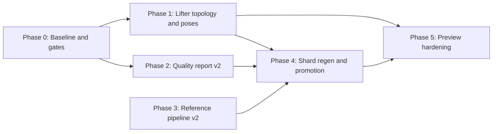

# Geometry lift assembly parity — multi-phase roadmap

**Status:** Planning (multitask-ready)  
**Pinned version:** 26.1.2 (`minecraft-26.1.2-client.jar`)  
**Trigger:** Models like `CreeperModel` report `ok` with all three `reference*Match: true` in [`geometry-lift-quality-26.1.2.json`](generated/geometry-lift-quality-26.1.2.json), yet Explore 3D preview shows wrong assembly (e.g. legs above head).

**Related docs:** [`generated/geometry-ir-conventions.md`](generated/geometry-ir-conventions.md), [`test-guidance-geometry-animation-ir.md`](test-guidance-geometry-animation-ir.md), [`vanilla-preview-parity.md`](vanilla-preview-parity.md)

---

## Executive summary

Current lift-quality checks validate **IR ↔ `reference_java` local agreement** (cuboids by part id, local poses, sorted cuboid fingerprint multiset). They do **not** validate **composed world layout** or **vanilla `javap` ground truth**.

The creeper failure mode is representative of a **class** of quadruped / humanoid-adjacent rigs:

| Gap | Symptom | Example (creeper) |
|-----|---------|---------------------|
| Flat part tree (no `addOrReplaceChild` edges) | Parts composed from `root` only; body rotation does not affect legs | `suspectedFlatNestedPartCount: 4` when report is fresh |
| Missing / wrong `PartPose.offsetAndRotation` | Body has zero rotation; wrong leg/head pivots | Body `T(0,6,0)` vs parity `T(0,5,2)+Rx(π/2)` |
| Preview repair without pose rebase | `GeometryIrPartTreeRepair` reparents legs under `body` without changing child translation | Can worsen world Y (18+6) |
| Circular reference | `reference_java` bake matches wrong IR | All three reference flags green |

**Goal:** Lift true hierarchy + poses into IR, add non-circular quality gates, and promote models only when **assembled** preview matches vanilla.

---

## Problem statement (from analysis)

### What the three reference checks actually measure

| Field | Compares | Does *not* check |
|-------|----------|------------------|
| `referenceCuboidsMatch` | Per-part **local** `from`/`to` by part id | World-space layout, hierarchy |
| `referencePosesMatch` | Per-part **local** pose (only if `poseApproxCount == 0`) | Composed parent→child transforms |
| `referenceMeshMatch` | **Sorted multiset** of cuboid fingerprints (`CompareReferenceToParityMesh`) | Part order, connectivity, viewport sanity |

Quality mesh path applies `GeometryIrPartTreeRepair` + `GeometryIrReferencePoseSync` before compare — passes can hide Explore regressions.

### Creeper shard facts (26.1.2)

- **Host:** `net.minecraft.client.model.monster.creeper.CreeperModel`
- **Extraction note:** `No PartDefinition / PartDefinition-equivalent addChild binding lines found in mesh factory javap`
- **Structure:** Six parts as flat siblings under `root` (head, body, four legs)
- **IR vs hand parity** (`CleanRoomEntityMonsters.BuildCreeper`):

| Part | Lifted IR / `reference_java` | `javap`-verified clean-room |
|------|------------------------------|-----------------------------|
| `head` | `T(0, 6, 0)` | `T(0, 6, -8)` |
| `body` | `T(0, 6, 0)`, no rotation | `T(0, 5, 2)` + `Rx(π/2)` |
| legs | `T(±2, 18, ±4)` | `T(±3, 12, ±7)` / `±5` |

CowModel shows the lifter **can** lift body rotation when bytecode parses (`rotationEulerRad: [1.570796371, …]`). Creeper’s factory pattern is the gap.

### Stale quality report warning

Committed [`geometry-lift-quality-26.1.2.json`](generated/geometry-lift-quality-26.1.2.json) may show creeper `rootChildCount: 2`, `suspectedFlatNestedPartCount: 0`. Regenerating (`AUTOPBR_WRITE_GEOMETRY_LIFT_QUALITY`) yields `rootChildCount: 6`, `suspectedFlatNestedPartCount: 4`, and creeper in `prioritizedBacklogJvmNames` — while reference flags can still be `true`.

---

## Roadmap overview



| Phase | Theme | Parallel-safe? | Blocks promotion? |
|-------|--------|----------------|-------------------|
| **0** | Baseline metrics, pilot list, regenerate quality JSON | Yes (3 agents) | No |
| **1** | Bytecode lifter: hierarchy + `offsetAndRotation` | Partial (2–4 agents by pattern) | Yes |
| **2** | Quality report new fields + CI gates | Yes (2 agents) | Yes |
| **3** | Reference bake improvements | Yes (1–2 agents) | Yes |
| **4** | Batch regen shards + index + quality JSON | Serial per JVM batch | Yes |
| **5** | Preview repair policy + viewport tests | Yes (2 agents) | No (after P4 pilots) |

---

## Multitask agent briefs

Copy each **Agent task** block into a separate multitask agent. Set `subagent_type` per column. **Do not** start Phase 4 until Phase 1 deliverables merge for that model family.

### Conventions for all agents

- **Repo root:** `z:\Cursor Projects\AutoPBR`
- **Jar:** `tools/minecraft-parity/26.1.2/client.jar` (skip jar tests if missing; document skip)
- **Test tiers:** Follow [`test-guidance-geometry-animation-ir.md`](test-guidance-geometry-animation-ir.md) — no new default-CI goldens on unpromoted shards
- **Allowlists:** `src/AutoPBR.Core/Data/minecraft-native/*.txt` — promotion in same PR as shard
- **kluster:** Run after code changes per workspace rules

---

## Phase 0 — Baseline and instrumentation (parallel)

**Objective:** Truthful backlog, pilot JVM set, and reproducible metrics before lifter changes.

### Agent 0A — Regenerate and diff quality report

```text
TASK: Regenerate geometry-lift-quality-26.1.2.json and document drift.

STEPS:
1. Set AUTOPBR_WRITE_GEOMETRY_LIFT_QUALITY=docs/generated/geometry-lift-quality-26.1.2.json
2. Run GeometryIrLiftQualityReportTests (Write_quality_report_when_env_set)
3. Diff old vs new: prioritizedBacklogJvmNames, creeper row (rootChildCount, suspectedFlatNestedPartCount)
4. Add a short "last regenerated" note to docs/generated/README.md if appropriate

DELIVERABLE: Updated geometry-lift-quality-26.1.2.json + summary of models with suspectedFlatNestedPartCount > 0 but reference*Match true.

subagent_type: shell
```

### Agent 0B — Creeper / quadruped pilot manifest

```text
TASK: Define pilot JVM list for assembly-parity work (T1 promotion targets).

STEPS:
1. Start from prioritizedBacklogJvmNames in fresh quality report
2. Add must-fix pilots: CreeperModel, QuadrupedModel, CowModel, SheepModel, PigModel
3. Create docs/generated/geometry-assembly-parity-pilots-26.1.2.txt (one JVM per line)
4. Cross-link in this roadmap

DELIVERABLE: Pilot list file + table in roadmap appendix.

subagent_type: explore
```

### Agent 0C — Javap oracle capture for pilots

```text
TASK: Capture creeper + cow createBodyLayer javap excerpts for pose/hierarchy oracle tests.

STEPS:
1. Extract CreeperModel.class and CowModel.class from client.jar (ZipFile single entry)
2. javap -c -constants → save under tools/minecraft-parity/26.1.2/javap-snapshots/ (gitignore or committed per repo policy)
3. Document PartPose.offsetAndRotation lines for body, head, legs in roadmap appendix

DELIVERABLE: Snapshot files or inline appendix table; list of invoke patterns the lifter must handle.

subagent_type: shell
```

**Phase 0 exit criteria**

- [ ] Fresh `geometry-lift-quality-26.1.2.json` committed or regeneration command documented
- [x] `geometry-assembly-parity-pilots-26.1.2.txt` exists (56 JVMs; see [Appendix D](#appendix-d--pilot-list-generated))
- [ ] Creeper vs cow javap pose table documented

---

## Phase 1 — Lifter: topology and poses (parallel workstreams)

**Objective:** Lift `PartDefinition.addOrReplaceChild` graph and full `PartPose` (including `offsetAndRotation`) into IR shards.

**Primary code:** `src/AutoPBR.Tools.GeometryCompiler/JavapFloatGeometryMeshLift.cs`, `BytecodeGeometryMeshLift.cs`, `BytecodeMeshResolution.cs`

### Agent 1A — addOrReplaceChild binding recovery

```text
TASK: Fix "No PartDefinition addChild binding lines found" for creeper-like factories.

FOCUS:
- CreeperModel.createBodyLayer (26.1.2 named jar)
- Split-line javap comments, fluent chains, ldc ordering vs aload receiver
- Reuse QuadrupedMeshLiftTests / PartialModelLiftDiagnosticsTests patterns

TESTS (T0):
- New: CreeperModel_lift_recovers_part_hierarchy (jar-gated)
- Assert maxTreeDepth >= 2 OR legs nested under body in lifted roots

DELIVERABLE: Lifter PR; creeper shard shows body.children containing legs OR documented why vanilla is flat with composed poses only.

subagent_type: generalPurpose
```

### Agent 1B — offsetAndRotation and shared leg builder

```text
TASK: Ensure offsetAndRotation(6-float) and shared CubeListBuilder leg segments lift correctly.

FOCUS:
- PartPose.offsetAndRotation before addOrReplaceChild
- Reused builder: ldc legName, aload builder, PartPose, bind (Quadruped createLegs pattern)
- Compare lifted creeper body pose to CleanRoomEntityMonsters.BuildCreeper comments

TESTS (T0):
- Creeper body rotationEulerRad[0] ≈ π/2 within tolerance
- Leg translations closer to (±3, 12, ±7) than (±2, 18, ±4)

DELIVERABLE: Lifter changes + failing→passing unit tests on jar.

subagent_type: generalPurpose
```

### Agent 1C — CubeDeformation and lift warnings (lower priority)

```text
TASK: Lift CubeDeformation / inflate where it affects cuboid corners; surface liftWarnings in shard.

FOCUS:
- Creeper head/body deformation constants from javap
- liftWarnings in geometry-lift-quality liftWarningCounts

DELIVERABLE: Optional v2 cuboid metadata; not blocking creeper pose fix.

subagent_type: generalPurpose
```

### Agent 1D — Delegation / mesh host resolution

```text
TASK: Verify CreeperModel mesh host resolution and deep concat (no wrong island merge).

FOCUS:
- BytecodeMeshResolution, DualLiftRegressionTests
- If createBodyLayer delegates, ensure poses come from correct island

DELIVERABLE: Test or note in extractionNotes when host != model class.

subagent_type: explore
```

**Phase 1 exit criteria**

- [ ] Creeper IR: body `rotationEulerRad[0] ≈ π/2` OR hierarchy nests legs under rotated body
- [ ] `extractionNotes` no longer claim missing addChild for creeper (or status → `partial` with honest notes)
- [ ] T0 tests green on jar; no false T1 promotion yet

---

## Phase 2 — Quality report v2 (parallel)

**Objective:** Non-circular gates so `ok` + `reference*Match` cannot imply correct assembly.

**Primary code:** `src/AutoPBR.Core/Preview/GeometryIrLiftQualityReport.cs`, `GeometryIrReferenceComparer.cs`

### Agent 2A — Composed world-pose compare

```text
TASK: Add referenceWorldPoseMatch (or composedPartOriginMatch) to lift quality report.

STEPS:
1. Walk IR with GeometryIrMeshWalk + TryComposePartPosePublic → world translation per part id
2. Same walk on reference_java (or javap-oracle poses applied to repaired tree)
3. Compare with tolerance; store message in report entry

INTEGRATION:
- GeometryIrLiftQualityReport.AnalyzeShard new fields
- WriteJson schemaVersion bump or document new fields

DELIVERABLE: Report entries fail for creeper when world origins diverge.

subagent_type: generalPurpose
```

### Agent 2B — Policy gates on flat nested + warnings

```text
TASK: Gate promotion on suspectedFlatNestedPartCount and lift binding failures.

STEPS:
1. If suspectedFlatNestedPartCount > 0 and hierarchy not lifted → flag referenceHierarchyMatch: false
2. Parse extractionNotes for "addChild binding" → extractionBindingGap: true
3. Add to prioritizedBacklog sort before referenceCuboidsMatch

TESTS (T3):
- GeometryIrLiftQualityReportTests assert creeper fails new gate when shard still flat

DELIVERABLE: Quality report fields + tests (opt-in env ok).

subagent_type: generalPurpose
```

### Agent 2C — Javap pose oracle (independent of reference_java)

```text
TASK: Compare lifted poses to javap-parsed offsetAndRotation per part id.

STEPS:
1. Small parser or snapshot-driven expected poses for pilot JVMs
2. Field: javapPoseOracleMatch in quality report
3. Pilot file: geometry-assembly-parity-pilots-26.1.2.txt

DELIVERABLE: Breaks IR ↔ reference_java circular validation for poses.

subagent_type: generalPurpose
```

**Phase 2 exit criteria**

- [ ] Creeper fails at least one new gate in regenerated quality JSON
- [ ] Documented field list in `geometry-ir-conventions.md` or generated README

---

## Phase 3 — Reference pipeline v2 (parallel)

**Objective:** `reference_java` that validates assembly, not only local `ModelPart.getInitialPose()`.

**Primary code:** `tools/MinecraftGeometryReference/src/main/java/autopbr/reference/GeometryReferenceBake.java`

### Agent 3A — World-origin reference export

```text
TASK: Extend GeometryReferenceBake to export composed part origins (world translation per part id).

STEPS:
1. Walk ModelPart tree multiplying parent pose × child pose
2. Add optional "worldPose" or separate reference-world JSON alongside reference-output
3. Use for Phase 2 comparer (not only IR circular compare)

DELIVERABLE: net.minecraft.client.model.monster.creeper.CreeperModel-world.json or embedded worldPose on nodes.

subagent_type: generalPurpose
```

### Agent 3B — MeshDefinition / pre-bake pose probe

```text
TASK: Investigate if getInitialPose() loses offsetAndRotation for creeper body; document or fix bake source.

STEPS:
1. Compare LayerDefinition bake vs PartDefinition builder poses for creeper
2. If bake is lossy, export poses from builder path for reference

DELIVERABLE: ADR paragraph in this roadmap or vanilla-preview-parity.md.

subagent_type: explore
```

**Phase 3 exit criteria**

- [ ] Non-circular reference signal for creeper assembly (world poses or builder poses)
- [ ] Export-GeometryReference.ps1 updated for pilot models

---

## Phase 4 — Regeneration and promotion (batched parallel)

**Objective:** Regenerate shards for pilot JVMs; promote via allowlists only when new gates pass.

### Agent 4A — Regenerate creeper + quadruped cluster shards

```text
TASK: Regenerate geometry shards for geometry-assembly-parity-pilots-26.1.2.txt (batch 1: monsters + QuadrupedModel).

STEPS:
1. GeometryCompiler lift for each JVM
2. Regenerate geometry-index-26.1.2.json (Generate-GeometryIndex.ps1)
3. Regenerate geometry-lift-quality-26.1.2.json
4. Do NOT set ok if new gates fail — use partial + extractionNotes

DELIVERABLE: PR with shard diffs + quality report.

subagent_type: shell
```

### Agent 4B — Regenerate animal quadruped batch

```text
TASK: Same as 4A for cow, pig, sheep, wolf, etc. (batch 2).

subagent_type: shell
```

### Agent 4C — Allowlist and T1 promotion

```text
TASK: Update allowlists and T1 tests only for JVMs passing all Phase 2 gates.

FILES:
- geometry_ir_partial_to_ok_promotion_jvm.txt
- geometry_ir_reference_cuboid_strict_jvm.txt (if world pose tests added)
- Mob family pilots as appropriate

DELIVERABLE: Same PR as 4A/4B or follow-up PR.

subagent_type: generalPurpose
```

**Phase 4 exit criteria**

- [ ] Creeper passes `javapPoseOracleMatch` + `referenceWorldPoseMatch` (or equivalent)
- [ ] Explore 3D creeper visually correct (manual checklist)
- [ ] Allowlists updated in same PR as shards

---

## Phase 5 — Preview hardening (parallel)

**Objective:** Safe preview path until IR is fixed; prevent repair from making layout worse.

**Primary code:** `GeometryIrPartTreeRepair.cs`, `CleanRoomEntityGeometryIrParityCatalog.cs`

### Agent 5A — Reparent with pose rebase

```text
TASK: When ReparentFlatPart moves leg under body, rebase child pose into parent space (or skip reparent if poses are root-absolute).

STEPS:
1. Document vanilla: flat siblings vs nested in baked ModelPart for creeper
2. If Java bake is flat, disable leg→body reparent for creeper JVM allowlist OR rebase translations

DELIVERABLE: Creeper preview correct even before full hierarchy lift OR explicit "no reparent" policy.

subagent_type: generalPurpose
```

### Agent 5B — Viewport sanity tests (T2/T1)

```text
TASK: Add viewport AABB tests after ApplyLivingEntityRendererPreviewBasis for pilot mobs.

PATTERN: EntityTextureParityAssemblyCohesionTests, MinecraftJavaModelPreviewTests world AABB helpers

ASSERT: Leg elements centroid Y below head centroid Y in preview space (creeper, cow pilots).

DELIVERABLE: Tests on allowlist only; jar + shard required.

subagent_type: generalPurpose
```

**Phase 5 exit criteria**

- [ ] Creeper Explore preview matches vanilla screenshot expectation
- [ ] T1 viewport test for creeper on strict allowlist

---

## Parallel execution matrix (multitasker)

Use this table to launch **independent** agents in one multitask batch. Wait for merge between phases.

| Batch | Agents | Can run together | Merge dependency |
|-------|--------|------------------|------------------|
| **0** | 0A, 0B, 0C | Yes | None |
| **1** | 1A, 1B | Yes (coordinate on JavapFloatGeometryMeshLift.cs) | 1A+1B before 4 |
| **1** | 1C, 1D | Yes | Optional |
| **2** | 2A, 2B, 2C | Yes (2C needs 0C snapshots) | Before 4 |
| **3** | 3A, 3B | Yes | Before 4 (helps 2A) |
| **4** | 4A, 4B | Yes (different JVM batches) | After 1+2 |
| **4** | 4C | After 4A+4B | After 4A+4B |
| **5** | 5A, 5B | Yes | After 4 for creeper OR parallel if preview-only hotfix |

**Suggested multitask prompt (paste into Multitask Mode):**

```text
Execute Phase 0 of docs/geometry-lift-assembly-parity-roadmap.md:
- Agent 0A: regenerate geometry-lift-quality-26.1.2.json
- Agent 0B: create geometry-assembly-parity-pilots-26.1.2.txt
- Agent 0C: javap snapshots for CreeperModel and CowModel

Then Phase 1 agents 1A+1B in parallel. Report blockers before Phase 4.
```

---

## Acceptance criteria (program level)

1. **No false green:** A model with `suspectedFlatNestedPartCount > 0` and missing body `offsetAndRotation` cannot have all assembly gates pass.
2. **Creeper pilot:** Head, body, legs in plausible relative positions in Explore 3D (legs below torso/head).
3. **Non-circular validation:** At least one quality field compares against javap oracle or world-composed poses, not only `reference_java` locals.
4. **Tier discipline:** New strict tests only on `geometry-assembly-parity-pilots-26.1.2.txt` allowlist.
5. **Regenerated artifacts:** `geometry-lift-quality-26.1.2.json` reflects current shard metrics (creeper `rootChildCount: 6`, `suspectedFlatNestedPartCount: 4` until fixed).

---

## Appendix A — Key file map

| Area | Path |
|------|------|
| Quality report builder | `src/AutoPBR.Core/Preview/GeometryIrLiftQualityReport.cs` |
| Reference comparer | `src/AutoPBR.Core/Preview/GeometryIrReferenceComparer.cs` |
| Preview mesh walk | `src/AutoPBR.Core/Preview/GeometryIrMeshWalk.cs` |
| Part tree repair | `src/AutoPBR.Core/Preview/GeometryIrPartTreeRepair.cs` |
| Parity catalog emit | `src/AutoPBR.Core/Preview/Entities/CleanRoomEntityGeometryIrParityCatalog.cs` |
| Creeper hand parity | `src/AutoPBR.Core/Preview/Entities/CleanRoomEntityMonsters.cs` (`BuildCreeper`) |
| Bytecode lifter | `src/AutoPBR.Tools.GeometryCompiler/JavapFloatGeometryMeshLift.cs` |
| Creeper IR shard | `docs/generated/geometry/26.1.2/net.minecraft.client.model.monster.creeper.CreeperModel.json` |
| Reference bake | `tools/MinecraftGeometryReference/reference-output/...CreeperModel.json` |
| Quality JSON | `docs/generated/geometry-lift-quality-26.1.2.json` |
| Assembly-parity pilots (T1) | `docs/generated/geometry-assembly-parity-pilots-26.1.2.txt` |

---

## Appendix B — Models likely affected (non-exhaustive)

From fresh quality backlog pattern (`suspectedFlatNestedPartCount > 0` + reference match):

- `QuadrupedModel`, `CowModel`, `SheepModel`, `PigModel`, `FoxModel`, `CamelModel`, `GoatModel`, `LlamaModel`, `PandaModel`, `PolarBearModel`, `RabbitModel`, `WolfModel`, `ArmadilloModel`, `AxolotlModel`, `SnifferModel`, `TurtleModel`, `HorseModel` / equine family, `CreeperModel`, `RavagerModel`, `EnderDragonModel` (verify per shard)

Treat as **family fixes** in the lifter, not one-off creeper hacks.

---

## Appendix C — What must be lifted (checklist)

| Data | In IR today? | Must lift? |
|------|--------------|------------|
| `PartDefinition` parent→child edges | Often missing (flat root) | **Yes** |
| `PartPose.offset` | Partial | **Yes** |
| `PartPose.offsetAndRotation` | Missing on creeper body | **Yes** |
| Shared leg `CubeListBuilder` binds | Partial | **Yes** |
| `CubeDeformation` | Often omitted | Nice-to-have |
| `setupAnim` default pose | Separate animation IR | Only if rest pose incomplete |
| LivingEntityRenderer basis | Preview-only | Already applied; not a lift field |

---

## Appendix D — Pilot list (generated)

Agent **0B** output: [`geometry-assembly-parity-pilots-26.1.2.txt`](generated/geometry-assembly-parity-pilots-26.1.2.txt).

| Field | Value |
|-------|-------|
| **Pilot JVM count** | 56 |
| **Source** | `prioritizedBacklogJvmNames` in [`geometry-lift-quality-26.1.2.json`](generated/geometry-lift-quality-26.1.2.json) (`generatedUtc` 2026-05-19T07:40:20Z), union **must-fix** assembly pilots: `CreeperModel`, `QuadrupedModel`, `CowModel`, `SheepModel`, `PigModel` (all five already present in backlog after refresh) |
| **Format** | One `officialJvmName` per line; `#` section comments |

Regenerate quality JSON before refreshing pilots: `AUTOPBR_WRITE_GEOMETRY_LIFT_QUALITY=docs/generated/geometry-lift-quality-26.1.2.json` + `Write_quality_report_when_env_set` (see [test guidance](test-guidance-geometry-animation-ir.md)).

---

*Generated from assembly-parity analysis (creeper false-positive `reference*Match` investigation). Update this doc when phases complete.*
