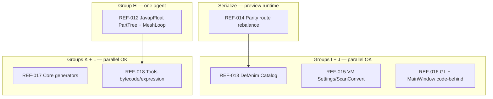
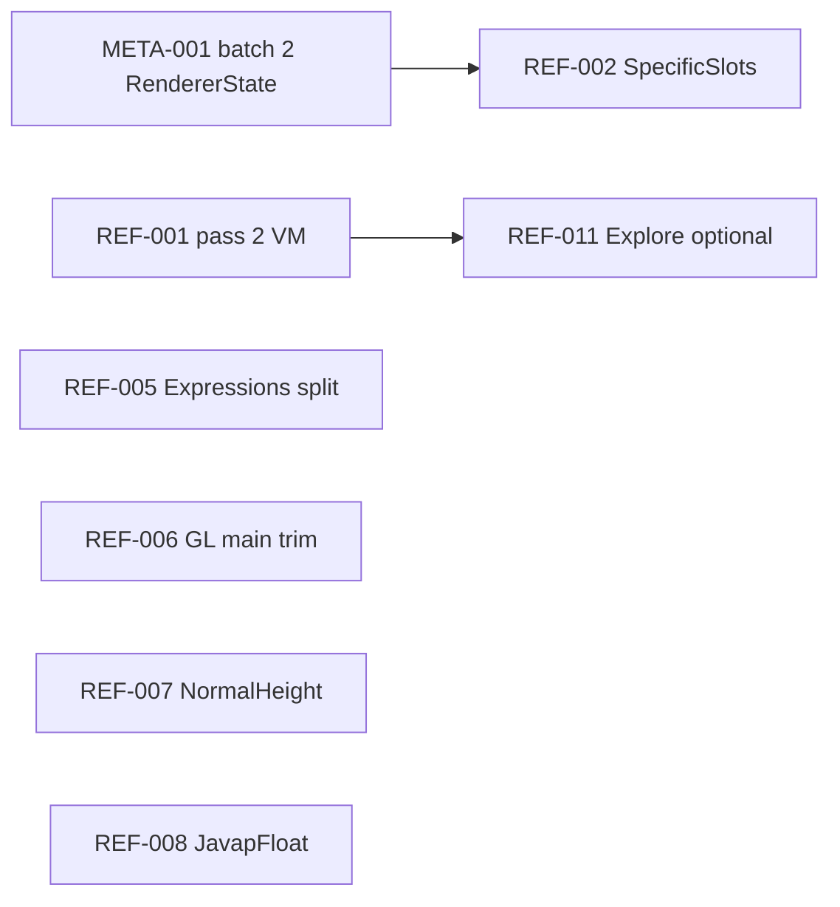

# Large-class split refactor plan (multi-agent)

**Status:** Phase 1 complete — Phase 2 roadmap active (geometry compiler, catalog sampling, app shell, line-balanced parity routes)  
**Created:** 2026-05-22 (line-count audit of `src/` + `tests/`)  
**Updated:** 2026-05-27 (Phase 2 rebaseline + multi-agent roadmap after CleanRoom / dispatch / parity-catalog pass 5)  
**Goal:** Improve AI context readability, IDE navigation, and compile-time locality **without** behavior changes.  
**Related:** [`runtime-ir-preview-plan.md`](runtime-ir-preview-plan.md), [`manual-explore-playbook.md`](manual-explore-playbook.md), [`test-guidance-geometry-animation-ir.md`](test-guidance-geometry-animation-ir.md), [`vanilla-preview-parity.md`](vanilla-preview-parity.md), [`meta-001-test-triage.md`](meta-001-test-triage.md)

---

## Implementation snapshot

**Phase 1 (2026-05-25):** REF-001–011 and META-001 complete. Core suite green; GeometryCompiler has unrelated bytecode/lift failures.

**Phase 2 (2026-05-27):** Pass 5 complete (dispatch micro-shards, CleanRoom families, parity-catalog A/B, Explore tags, sampler tests). Active work: **REF-012–018** — see [Phase 2 roadmap](#phase-2-roadmap-2026-05-27--multi-agent).

| Area | State | Notes |
|------|-------|-------|
| **REF-001 VM** | **Done** | Seven partials: main (573), Preview (375), Settings (869), ScanConvert (710), Progress (422), Explore (406), TagRules (208). |
| **REF-002 Dispatch** | **Done** | Pass 5: 10 slot fragments (max **597** lines); 117 slots order-stable. See **REF-002 pass 5** in Phase 2 log. |
| **REF-002b CleanRoom families** | **Done** | Monsters, humanoids, quadrupeds, aquatic, flying — coordinators + themed build partials. |
| **REF-002c Parity catalog routes** | **Done** | 3 coordinators + 6 switch shards (A/B per route); case order preserved. Line imbalance remains — **REF-014**. |
| **REF-009b Sampler tests** | **Done** | `VanillaAnimationIrPreviewSamplerTests` split per mob (**129** tests). |
| **REF-011b Explore tags** | **Done** | `ExploreTreeController.Tags.*` — coordinator **57** lines; largest tag shard **399**. |
| **REF-003 MeshEmitter** | **Done** | `GeometryIrMeshEmitter.cs` **363** lines — under target; no further split needed now. |
| **REF-004 DefAnim** | **Done** | `CleanRoomEntityGeometryIrDefinitionAnimation.cs` **171** lines — family logic lives elsewhere; no split needed now. |
| **REF-005 SetupAnimLift** | **Done** | Expressions sub-split complete; largest shard is now under ~600 lines. |
| **REF-006 OpenGL** | **Done** | Six `partial` files; `OpenGlPreviewBackend.cs` is **523 lines** after moving lifecycle/render/shader helpers out of main. |
| **REF-007 NormalHeight** | **Done** | Split into three partials: main/orchestration (**562**), classical kernels (**602**), DeepBump adapter/fallback (**424**). |
| **REF-008 JavapFloat** | **Done** | Main shard **138** lines (13 partials total); segment, part-name, reused-builder, addBox, pose, and cube-deformation helpers split out. |
| **REF-009 / REF-010 tests** | **Superseded** | Monolithic `MinecraftJavaModelPreviewTests.cs` / `EntityTextureParityCatalogTests.cs` **no longer in tree**. Coverage is spread across smaller test classes. See **META-001** (csproj cleanup + re-enable). |
| **REF-011 Explore** | **Done** | Coordinator **78**, `TreeBuild` **691**, `BatchUi` **234**; tags sub-split via **REF-011b**. |
| **META-001 tests** | **Done** | `AutoPBR.Core.Tests.csproj` has **0 `Compile Remove` rows**; Core suite is **1853 pass / 0 fail**. |

Verification checkpoint:

| Command | Result |
|---------|--------|
| `dotnet build AutoPBR.sln -v minimal` | Pass, 5 existing analyzer warnings |
| `dotnet build src/AutoPBR.App/AutoPBR.App.csproj -v minimal` | Pass, 5 existing analyzer warnings |
| `dotnet test tests/AutoPBR.App.Tests/AutoPBR.App.Tests.csproj --no-restore` | Pass: **35/35** |
| `dotnet test tests/AutoPBR.Core.Tests/AutoPBR.Core.Tests.csproj --no-restore` | Pass: **1853/1853** |
| `dotnet test tests/AutoPBR.AnimationCompiler.Tests/AutoPBR.AnimationCompiler.Tests.csproj --no-restore` | Pass: **93/93** |
| `dotnet test tests/AutoPBR.GeometryCompiler.Tests/AutoPBR.GeometryCompiler.Tests.csproj --no-restore` | Fail: **334 pass / 29 fail / 363 total** |

Known red bucket after rebaseline: geometry compiler bytecode/lift behavior tests (`HumanoidDelegatedMeshLiftTests`, `Wave7PartialDrainTests`, `ClimatePartialLiftTests`, `MeshWidePrefixScopeTests`, `NestedHierarchyMeshLiftTests`, `BabyPigLiftDiagnosticTests`, and related lift diagnostics). These are not class-split regressions.

---

## Core principles (read first)

1. **Mechanical moves only** — same types, same method bodies, same branch order unless a separate design task explicitly changes semantics.
2. **No behavior PRs mixed with splits** — one agent task = file moves / `partial` extraction / test fixture moves. Bug fixes are a different PR.
3. **Order-sensitive code stays order-stable** — especially `CleanRoomEntityDispatch` GPU bone slots (`EntityGpuBoneDispatchKind.SpecificModelSlot`). Run routing inventory tests after every dispatch touch.
4. **Prefer `partial` over new public types** when splitting classes already marked `partial` or when callers should not change.
5. **Prefer extraction to existing coordinators** when a domain already has one (`ExploreTreeController` pattern).
6. **Generated code** (`.g.cs`, compiler outputs) — do not hand-split; shrink inputs or improve codegen instead.
7. **Verify every task** with targeted `dotnet test` (see per-task commands). Full solution test is optional unless the task touches shared contracts.

### Agent workflow (each task)

```text
1. Claim task ID (update Status table below or PR title: [REF-00N])
2. Read "Scope" + "Do not" + "Verification"
3. Create branch OR worktree if parallel with sibling tasks (see Parallel groups)
4. Apply mechanical split only
5. dotnet build + listed tests
6. PR description: list new files, assert zero logic diff (optional: git diff -w --ignore-blank-lines)
```

### Parallel groups — Phase 1 (historical)

| Group | Tasks | Conflict risk |
|-------|-------|---------------|
| **A — App shell** | REF-001 | Low |
| **B — Preview entity runtime** | REF-002 | **High** — `CleanRoomEntityModelRuntime`; **serialize** |
| **C — Tools / GL** | REF-005, REF-006 | Low |
| **D — Core generators** | REF-007 | Low |
| **E — Geometry compiler** | REF-008 | Medium |
| **F — Tests / hygiene** | META-001 | Low |
| **G — Explore** | REF-011 | Low |

### Parallel groups — Phase 2 (multi-agent / multitalk)

Use **one task ID per agent thread**. Claim in PR title `[REF-01N]` and in the task status table. Prefer **git worktrees** when two tasks touch the same project but different paths.

| Group | Tasks | Conflict risk | Notes |
|-------|-------|---------------|-------|
| **H — Geometry compiler** | REF-012 | **High** — `JavapFloatGeometryMeshLift` partial type; **one agent** or serial sub-shards | Independent of preview runtime |
| **I — Core preview sampling** | REF-013, REF-014 | **Medium** — REF-013 touches `DefinitionAnimationPreviewSampling`; REF-014 touches `ParityCatalogDispatch.*` | **Do not** run REF-014 in parallel with dispatch slot edits |
| **J — App shell** | REF-015, REF-016 | Low–medium — VM vs. Views vs. GL; avoid same file | REF-015 and REF-016 can parallel if files disjoint |
| **K — Core generators** | REF-017 | Low — separate static classes | done |
| **L — Tools (non-javap)** | REF-018 | Low — `BytecodeMeshResolution`, `SetupAnimExpressionLift`, etc. | |
| **M — Core preview (optional)** | REF-019 | Medium — `GeometryIr*` preview helpers | Defer until H–L stable |
| **N — Tests (optional)** | REF-020 | Low | Large test fixtures only |

**Rules (Phase 2):**

1. Never reorder `CleanRoomEntityDispatch` GPU slots or parity-catalog `case` labels in the same PR as unrelated logic.
2. Never assign **REF-012** and **REF-014** to agents on the same branch without coordination (both touch preview/parity paths).
3. **REF-014** (line rebalance) should run alone on `ParityCatalogDispatch.*` — mechanical case moves only.
4. Phase 1 **REF-002b/c** is **done** — do not re-split CleanRoom families or SpecificSlots unless a file regrows past threshold.

---

## Baseline metrics (2026-05-27)

Production `src/` (hand-written `.cs`, excludes `obj`/`bin`/`.g.cs`):

| Bucket | Count | Target |
|--------|------:|--------|
| Total files | **387** | — |
| &lt; 300 lines | **287** (74%) | Ideal agent context |
| 300–599 lines | **75** (19%) | OK |
| 600–899 lines | **20** (5%) | Phase 2 split candidates |
| 900–1199 lines | **4** | P0 splits |
| ≥ 1200 lines | **1** | P0 — `PartTreeCollection.cs` only |

### Top shards (≥ 600 lines)

| Lines | Path | Phase 2 task |
|------:|------|----------------|
| 1224 | `src/AutoPBR.Tools.GeometryCompiler/JavapFloatGeometryMeshLift.PartTreeCollection.cs` | **REF-012** |
| 992 | `src/AutoPBR.Tools.GeometryCompiler/BytecodeMeshResolution.cs` | **REF-018** |
| 972 | `src/AutoPBR.Core/Preview/DefinitionAnimationPreviewSampling.Catalog.cs` | **REF-013** |
| 957 | `src/AutoPBR.Core/Preview/Entities/...ParityCatalogDispatch.EquipmentRoute.B.cs` | **REF-014** (rebalance) |
| 921 | `src/AutoPBR.Core/Preview/Entities/...ParityCatalogDispatch.CatalogRoute.A.cs` | **REF-014** (rebalance) |
| 868 | `src/AutoPBR.App/ViewModels/MainWindowViewModel.Settings.cs` | **REF-015** |
| 842 | `src/AutoPBR.Tools.GeometryCompiler/JavapFloatGeometryMeshLift.MeshLoop.cs` | **REF-012** |
| 823 | `src/AutoPBR.App/Rendering/OpenGL/OpenGlPreviewBackend.Render.cs` | **REF-016** |
| 813 | `src/AutoPBR.Core/SpecularGenerator.cs` | **REF-017** |
| 809 | `src/AutoPBR.Tools.GeometryCompiler/JavapClassDisassembly.cs` | **REF-018** |
| 790 | `src/AutoPBR.Core/Embeddings/MaterialTagSemanticMatcher.cs` | **REF-017** |
| 768 | `src/AutoPBR.Tools.GeometryCompiler/GeometryCompilerHost.cs` | **REF-018** |
| 753 | `src/AutoPBR.App/Views/MainWindow.axaml.cs` | **REF-016** |
| 748 | `src/AutoPBR.Core/Preview/GeometryIrLiftQualityReport.cs` | **REF-019** |
| 709 | `src/AutoPBR.App/ViewModels/MainWindowViewModel.ScanConvert.cs` | **REF-015** |
| 708 | `src/AutoPBR.Tools.AnimationCompiler/SetupAnimExpressionLift.cs` | **REF-018** |
| 691 | `src/AutoPBR.App/Services/ExploreTreeController.TreeBuild.cs` | Optional / P3 |
| 681 | `src/AutoPBR.Core/Preview/Entities/...ParityCatalogDispatch.Fallbacks.A.cs` | **REF-014** |
| 678 | `src/AutoPBR.Core/Preview/Entities/CleanRoomEntityGeometryIrParityMotion.cs` | **REF-019** (optional) |
| 673 | `src/AutoPBR.Core/Preview/GeometryIrPartTreeRepair.cs` | **REF-019** |
| 669 | `src/AutoPBR.Core/TextureScanner.cs` | **REF-017** |
| 635 | `src/AutoPBR.Core/Preview/Entities/CleanRoomEntityQuadrupeds.Build.Adults.cs` | Optional / P3 |
| 622 | `src/AutoPBR.Core/Preview/MinecraftModelBaker.cs` | **REF-019** |
| 601 | `src/AutoPBR.Core/NormalHeightGenerator.Classical.cs` | Done (REF-007) |
| 597 | `src/AutoPBR.Core/Preview/Entities/CleanRoomEntityDispatch.SpecificSlots.S01-25.cs` | Done — at target |

### Partial aggregates (rebaselined)

| Aggregate | Total lines | Files | Max shard | Status |
|-----------|------------:|------:|----------:|--------|
| `JavapFloatGeometryMeshLift` | ~5047 | 13 | **1224** | **REF-012** — PartTreeCollection + MeshLoop |
| `CleanRoomEntityModelRuntime.ParityCatalogDispatch` | ~3840 | 10 | **957** | Routes split; **REF-014** line rebalance |
| `CleanRoomEntityDispatch.SpecificSlots` | ~3240 | 12 | **597** | **Done** (pass 5) |
| `MainWindowViewModel` | ~2984 | 7 | **868** | **REF-015** Settings + ScanConvert |
| `CleanRoomEntity*` (families) | ~8k+ | 40+ | **635** | **Done** (pass 5) |
| `OpenGlPreviewBackend` | ~2071 | 6 | **823** | **REF-016** Render pass |
| `ExploreTreeController` | ~2089 | 8 | **691** | Tags **done**; TreeBuild optional |
| `SetupAnimLift` | ~2387 | 10 | **489** | **Done** |
| `DefinitionAnimationPreviewSampling` | ~1050 | 2 | **972** | **REF-013** Catalog shard |
| `VanillaAnimationIrPreviewSamplerTests` | ~1394 | 13 | ~180 | **Done** (REF-009b) |

### Acceptance line budgets (agent context)

| Domain | Per-shard target | Coordinator target |
|--------|------------------|---------------------|
| Dispatch / parity-catalog `switch` | ≤ **600** lines | ≤ **80** lines |
| ViewModels / Services | ≤ **700** lines | ≤ **600** lines |
| Tools / geometry compiler partials | ≤ **600** lines | ≤ **200** lines |
| Tests (fixture splits) | ≤ **450** lines | N/A |

Tests (`tests/`, ≥ 450 lines): **REF-020 done** — `GeometryIrLerMirrorComposeClassificationTests` (4 partials), `PreviewRenderingTests` (5 partials) + `GlslIncludeResolverTests`, `BindingGapPilotMeshLiftTests` (4 partials); all shards ≤ **195** lines.

**Re-baseline command** (PowerShell):

```powershell
Get-ChildItem -Path "src" -Recurse -Include *.cs -File |
  Where-Object { $_.FullName -notmatch '\\(obj|bin)\\' -and $_.Name -notmatch '\.g\.cs$' } |
  ForEach-Object {
    $lines = (Get-Content $_.FullName | Measure-Object -Line).Lines
    [PSCustomObject]@{ Lines = $lines; Path = $_.FullName.Replace((Get-Location).Path + '\', '') }
  } | Sort-Object Lines -Descending | Select-Object -First 30
```

Python (repo root): aggregate histogram — see Phase 2 audit notes in git history 2026-05-27.

---

## Task status

| ID | Title | Priority | Status | Notes |
|----|-------|----------|--------|-------|
| REF-001 | MainWindowViewModel partials | P0 | **`done`** | Final split done: Settings / ScanConvert / Progress / Explore / TagRules + Preview; all shards under ~900 lines |
| REF-002 | CleanRoomEntityDispatch shards | P0 | **`done`** | Pass 4 done: S01-50 (1121), S51-90 (869), S91-End (626); 117 slot blocks |
| REF-003 | GeometryIrMeshEmitter shards | P1 | **`done`** | 363 lines — no action |
| REF-004 | Definition-animation partial split | P1 | **`done`** | 171 lines — no action |
| REF-005 | SetupAnimLift partials | P1 | **`done`** | REF-005b complete; expression helpers split into smaller partials |
| REF-006 | OpenGlPreviewBackend partials | P1 | **`done`** | Main shard is **523** lines; `Render.cs` holds the GL frame loop. App build passes. |
| REF-007 | NormalHeightGenerator split | P2 | **`done`** | Split into main/orchestration (**562**), classical kernels (**602**), and DeepBump adapter/fallback (**424**) partials. |
| REF-008 | JavapFloatGeometryMeshLift main-file trim | P2 | **`done`** | Main shard is **138** lines; geometry compiler suite now runs but has existing bytecode/lift failures. |
| REF-009 | MinecraftJavaModelPreviewTests fixture split | P2 | **`superseded`** | Monolith removed; see META-001 |
| REF-010 | EntityTextureParityCatalogTests fixture split | P2 | **`superseded`** | Monolith removed; see META-001 |
| REF-011 | ExploreTreeController partials (optional) | P3 | **`done`** | Tags sub-split **REF-011b**; `TreeBuild` 691 optional |
| **META-001** | Core.Tests csproj hygiene + re-enable | **P0** | **`done`** | Core suite **1853 pass / 0 fail** |
| **REF-012** | JavapFloat `PartTreeCollection` + `MeshLoop` | **P0** | **`todo`** | Only ≥1200 and top ≥800 javap shards |
| **REF-013** | `DefinitionAnimationPreviewSampling.Catalog` | **P0** | **`todo`** | Split by mob family (~972 lines) |
| **REF-014** | Parity-catalog route **line rebalance** | **P1** | **`todo`** | A/B halves uneven (921/957/681 vs 317/473/369) |
| **REF-015** | MainWindowViewModel Settings + ScanConvert | **P1** | **`todo`** | 868 + 709 lines |
| **REF-016** | App GL Render + `MainWindow.axaml.cs` | **P1** | **`todo`** | 823 + 753 lines |
| **REF-017** | Core generators (Specular, TextureScanner, embeddings) | **P2** | **`done`** | Standalone classes → `partial` |
| **REF-018** | Tools: BytecodeMeshResolution, SetupAnimExpressionLift, … | **P2** | **`todo`** | Independent of REF-012 |
| **REF-019** | Core preview helpers (LiftQuality, PartTreeRepair, Baker) | **P3** | **`backlog`** | Optional |
| **REF-020** | Large test fixtures | **P3** | **`done`** | Partial splits: LER classification, PreviewRendering, BindingGap pilot |

---

## Phase 2 roadmap (2026-05-27) — multi-agent

Phase 1 (REF-001–011, META-001, dispatch pass 4) is **complete**. Phase 2 targets files still above agent-context thresholds after **pass 5** (CleanRoom families, SpecificSlots micro-shards, parity-catalog A/B routes, sampler tests, Explore tags).

### Multitalk / worktree quick start

| Step | Action |
|------|--------|
| 1 | Pick an unclaimed **`todo`** row from [Task status](#task-status) (REF-012–018). |
| 2 | Post claim: `Claiming REF-01N` in thread; set row to **`in_progress`** in your PR description. |
| 3 | Read [Parallel groups — Phase 2](#parallel-groups--phase-2-multi-agent--multitalk) — do not collide on same files. |
| 4 | Branch or worktree: `split/ref-01N-short-name` off latest `main`. |
| 5 | Copy the agent prompt from [Phase 2 task specs](#phase-2-task-specs-agent-copy-paste). |
| 6 | Mechanical split only → build → targeted tests → PR with line-count table. |
| 7 | Rebase [Baseline metrics](#baseline-metrics-2026-05-27) when merging. |

**One agent per REF ID per branch.** If two agents need the same partial type (e.g. `CleanRoomEntityModelRuntime`), **serialize** or use separate worktrees merged in PR order.

### What pass 5 completed (do not redo)

| Area | Outcome | Verification |
|------|---------|--------------|
| **SpecificSlots** | 10 fragments; max **597** lines (`S01-25` … `S105-End`) | 781 routing/parity tests |
| **CleanRoom families** | Monsters, humanoids, quadrupeds, aquatic, flying | Same filter |
| **Parity catalog routes** | 3 coordinators + 6× `switch` shards (21 cases each) | Same filter |
| **Explore tags** | `Tags.cs` + 4 themed partials | App build + explore tests |
| **Sampler tests** | Per-mob `VanillaAnimationIrPreviewSamplerTests.*` | **129/129** |

Mechanical split scripts (regenerate only from unsplit sources):

| Script | Purpose |
|--------|---------|
| `tools/split-parity-catalog-dispatch.py` | Monolith → Catalog / Equipment / Fallbacks routes |
| `tools/split-parity-catalog-route-half.py` | One route file → A/B by **case count** |
| `tools/split-specific-slots-51-end.py` | `S51-90` / `S91-End` → half slot ranges |

**REF-014** needs a **line-budget** variant of `split-parity-catalog-route-half.py` (not equal case count).

### Suggested PR sequence (parallel where groups allow)



| Order | Task | Group | Can parallel with |
|------:|------|-------|-------------------|
| 1 | **REF-012** | H | REF-015, REF-016, REF-017 (not REF-014) |
| 2 | **REF-013** | I | REF-015, REF-017, REF-018 |
| 3 | **REF-014** | I | **None** on `ParityCatalogDispatch.*` |
| 4 | **REF-015** | J | REF-012, REF-013, REF-017 |
| 5 | **REF-016** | J | REF-015 if different files |
| 6 | **REF-017** | K | Most Phase 2 tasks |
| 7 | **REF-018** | L | REF-017 |
| 8 | **REF-019**, **REF-020** | M, N | Any (backlog) |

### Standard verification (preview / dispatch touches)

```bash
dotnet build src/AutoPBR.Core/AutoPBR.Core.csproj
dotnet test tests/AutoPBR.Core.Tests/AutoPBR.Core.Tests.csproj \
  --filter "FullyQualifiedName~EntityTextureRoutingInventory|FullyQualifiedName~EntityTextureParity|FullyQualifiedName~CleanRoomEntityRuntime"
```

| Task | Additional verification |
|------|-------------------------|
| REF-012, REF-018 | `dotnet test tests/AutoPBR.GeometryCompiler.Tests/` |
| REF-013, REF-014 | Filter above + any `DefinitionAnimation` / catalog tests |
| REF-015, REF-016 | `dotnet test tests/AutoPBR.App.Tests/ --filter Preview` |
| REF-017 | `dotnet test tests/AutoPBR.Core.Tests/ --filter Specular\|Texture\|MaterialTag` (if exist) |
| REF-005 / animation tools | `dotnet test tests/AutoPBR.AnimationCompiler.Tests/` |

### Non-split follow-ups (outside Phase 2)

1. Triage **29** failing `AutoPBR.GeometryCompiler.Tests` bytecode/lift cases — not split regressions.
2. [`meta-001-test-triage.md`](meta-001-test-triage.md) — runtime parity failures.
3. **Future optimization:** table-driven / generated dispatch and parity-catalog switches (separate design task; depends on stable shards).

## Historical completion log

**Completed 2026-05-23 — META-001 batch 1**

- Removed 8 stale `Compile Remove` rows (superseded `EntityTextureParityCatalogTests.*` / `MinecraftJavaModelPreviewTests.*` split paths).
- Re-enabled: `EntityTextureRoutingInventoryTests`, `SetupAnimGeometryIrPreviewTests`, `EntityTextureParityJsonCatalogTests`, `MinecraftPreviewVersionGateTests`.

**Completed 2026-05-23 — REF-001 pass 2, REF-002 pass 2, META-001 batch 2**

- **REF-001:** `MainWindowViewModel.{Settings,ScanConvert,Explore,TagRules}.cs` extracted; main ~460 lines.
- **REF-002:** `CleanRoomEntityDispatch.SpecificSlots.cs` (~2156 lines); main ~344 lines; routing inventory green.
- **META-001 batch 2:** All 9 `RendererState*.cs` re-enabled. Tests required restoring P6 preview code (`RendererStateDocumentLoader`, `RendererStatePreviewResolver`, `PreviewRenderStateSynthesis.For*`); **34/34 RendererState tests pass**.

**Completed 2026-05-23 — META-001 batch 3**

- Re-enabled **28** remaining test files (GPU bone, mob-family fidelity, parity survey, phase alignment, chicken/cod probes, etc.).
- **6 files stay excluded** — compile errors (missing Core APIs deleted in prior WIP cleanup):
  - `GeometryIrBreezeParityEmitTests`, `GeometryIrHoglinViewportLerTests`, `GeometryIrLerMirrorComposeClassificationTests` — missing `CleanRoomEntityModelRuntime` LER/legacy test hooks
  - `GeometryIrUvAtlasQualityTests` — missing `GeometryIrUvAtlasQuality` type
  - `GeometryJavapPoseOracleTests` — `ParseExpectedPosesFromJavap` overload mismatch
  - `VanillaAnimationIrPreviewSamplerTests` — missing `DefinitionAnimationPreviewSampling.TrySample*` helpers
- **1600 pass / 45 fail** (1645 total). New failures are mostly geometry-IR reference alignment, parity survey milestones, and pre-existing fox setup-anim — not csproj blockers.

**Completed 2026-05-23 — META-001 Wave A**

- Restored `GeometryIrUvAtlasQuality`, `GeometryJavapPoseOracle` 2-arg overload, ~155 `TrySample*` catalog methods.
- Re-enabled `GeometryIrUvAtlasQualityTests`, `GeometryJavapPoseOracleTests`, `VanillaAnimationIrPreviewSamplerTests`.
- Sampler suite **129/129**; UV atlas **5/6** (Breeze wind layer atlas mismatch); javap oracle **2/21** (delegate merge incomplete).

**Completed 2026-05-23 — META-001 Wave B**

- Added `CleanRoomEntityGeometryIrLerTestHooks.cs` (LER classification, parity basis, legacy Breeze catalog mesh, `TryBuildGeometryIrParityMeshForTestsWithLerCompose`).
- Re-enabled `GeometryIrBreezeParityEmitTests`, `GeometryIrHoglinViewportLerTests`, `GeometryIrLerMirrorComposeClassificationTests`.
- **0 compile-blocked files** in Core.Tests. Targeted LER/breeze/hoglin filter: **46/50 pass** (4 runtime parity failures).

**Completed 2026-05-23 — REF-002 pass 3**

- Sub-split `CleanRoomEntityDispatch.SpecificSlots` into coordinator (71 lines) + `S01-50` (~1120) + `S51-100` (~1457, slots 51–117).
- Ladder recovered from git HEAD monolith; routing inventory tests green.

**Completed 2026-05-25 — REF-002 pass 4**

- Sub-split the oversized `S51-100` shard into `S51-90` (868 lines, 40 slot branches) and `S91-End` (625 lines, 27 slot branches), leaving `S51-100` as a 63-line coordinator.
- Routing-focused verification was later unblocked by REF-007 completion.

**Completed 2026-05-25 — REF-001 final split + verification rebaseline**

- Moved coalesced scan/conversion progress reporting into `MainWindowViewModel.Progress.cs` (422 lines).
- `MainWindowViewModel.ScanConvert.cs` is now 710 lines and every `MainWindowViewModel` partial is under the REF-001 target.
- `dotnet build AutoPBR.sln`, App build, App tests, Core tests, and AnimationCompiler tests pass. `AutoPBR.GeometryCompiler.Tests` runs but has 29 existing bytecode/lift failures.

**Completed 2026-05-27 — REF-002 pass 5 (CleanRoom + dispatch + parity-catalog)**

- **SpecificSlots:** `S01-50` → `S01-25` + `S26-50`; `S51-90` → `S51-70` + `S71-90`; `S91-End` → `S91-104` + `S105-End` (117 slots, order preserved).
- **CleanRoom families:** `Monsters`, `Humanoids`, `Quadrupeds`, `Aquatic`, `Flying` — coordinators + themed `.Build.*` / `.Append.*` partials.
- **Parity catalog:** `CatalogRoute`, `EquipmentRoute`, `Fallbacks` → A/B switch shards via `split-parity-catalog-route-half.py`.
- **Explore tags:** `ExploreTreeController.Tags.*` (RuleResolution, BatchOps, CatalogLookup, Diagnostics).
- **Sampler tests:** `VanillaAnimationIrPreviewSamplerTests.*` per mob.
- Routing/parity filter: **781/781** pass.

Completed priorities — see [`meta-001-test-triage.md`](meta-001-test-triage.md) for non-split runtime triage:

1. ~~**META-001 Wave A**~~ ✅ — Javap oracle, UV atlas quality, sampler catalog (3 files re-enabled).
2. ~~**META-001 Wave B**~~ ✅ compile-unblock — LER hooks + breeze legacy helper (last 3 files re-enabled).
3. ~~**META-001 Wave C (Wave B leftovers)**~~ ✅ — Breeze multi-atlas emit + feline LER probe (**50/50** targeted suites).
4. ~~**META-001 Wave C (runtime triage)**~~ ✅ — Core suite baseline is **1853/0**.
5. ~~**REF-005b**~~ ✅ — Sub-split `SetupAnimLift.Expressions.cs`.
6. ~~**REF-006 pass 2**~~ ✅ — Trim main `OpenGlPreviewBackend.cs`.
7. ~~**REF-007, REF-008, REF-011**~~ ✅ — NormalHeight, JavapFloat, and Explore splits complete.

~~Deferred (done):~~

~~1. REF-001 pass 2~~ ✅  
~~2. META-001 batch 2~~ ✅  
~~3. REF-002 pass 2~~ ✅  
~~4. META-001 batch 3~~ ✅  
~~5. REF-002 pass 3~~ ✅  

Legacy notes (superseded by completions above):

1. ~~**REF-001 pass 2**~~ — see completion block above.
2. ~~**META-001 batch 2**~~ — see completion block above.
3. ~~**REF-002 pass 2**~~ — see completion block above.



**Suggested PR sequence:**

1. ~~META-001 batch 1~~ ✅  
2. REF-001 pass 2 (App VM — independent)  
3. META-001 batch 2 + fox setup-anim test fix (can parallel REF-001)  
4. REF-005b + REF-006 pass 2 (parallel, different projects)  
5. REF-002 pass 2 (serial; routing inventory already green)  
6. REF-007, REF-008, REF-011  

---

## Agent prompts (copy-paste for parallel work)

### REF-001 pass 2 — VM partials

```text
Mechanical split only. Read docs/large-class-split-agent-plan.md REF-001.
Create MainWindowViewModel.Settings.cs, .ScanConvert.cs, .Explore.cs, .TagRules.cs.
Leave shared fields, ctor, Dispose, AddLogLine, UpdatePreviewAsync in MainWindowViewModel.cs.
Do NOT touch MainWindowViewModel.Preview.cs except to avoid duplicate handlers.
Verify: dotnet build src/AutoPBR.App && dotnet test tests/AutoPBR.App.Tests --filter Preview
Target: MainWindowViewModel.cs < 800 lines; each partial < 900 lines.
```

### REF-002 pass 2 — Dispatch SpecificSlots

```text
Mechanical split only. Read docs/large-class-split-agent-plan.md REF-002.
Create CleanRoomEntityDispatch.SpecificSlots.cs; move TryBuildSpecific ladder verbatim (same branch order).
Verify: dotnet test tests/AutoPBR.Core.Tests --filter EntityTextureRoutingInventory
```

### META-001 batch 2 — RendererState tests

```text
Remove Compile Remove for RendererStateAllayPreviewTests.cs only; build + test --filter RendererStateAllay.
Repeat for each RendererState*.cs file. Keep excluded if compile fails.
Document remaining exclusions in csproj comment.
```

---

## REF-001 — MainWindowViewModel partials (P0)

**Problem:** Original VM monolith exceeded useful AI/editor context. It is now split into focused partials.

**Done (2026-05-22 recovery):**

- `MainWindowViewModel.Preview.cs` — GL registration, 3D render settings, GPU push, camera pose timer, `ApplyPreviewDetailedResult`, `SpecularForceNoEmissive` handler.

**Done (2026-05-25 rebaseline):**

| File | Lines | Contents |
|------|------:|----------|
| `MainWindowViewModel.cs` | 573 | ctor, core fields, `IDisposable`, shared helpers, preview orchestration |
| `MainWindowViewModel.Preview.cs` | 375 | GL registration, render settings, camera pose timer, preview result application |
| `MainWindowViewModel.Settings.cs` | 869 | settings persistence, culture/options refresh, UI scale, ML option lists |
| `MainWindowViewModel.ScanConvert.cs` | 710 | scan/archive/batch conversion orchestration, cancel, background task sink |
| `MainWindowViewModel.Progress.cs` | 422 | coalesced scan/conversion progress reporters and timing helpers |
| `MainWindowViewModel.Explore.cs` | 406 | explore commands delegated to `ExploreTreeController` |
| `MainWindowViewModel.TagRules.cs` | 208 | tag overrides, rules refresh, semantic debug command |

### Do not

- Change command names, `CanExecute` logic, or binding property names.
- Move logic out of `ExploreTreeController` in this task (that's REF-011).
- Re-introduce duplicate preview refresh paths between monolith and `Preview.cs`.

### Verification

```bash
dotnet build src/AutoPBR.App/AutoPBR.App.csproj
dotnet test tests/AutoPBR.App.Tests/AutoPBR.App.Tests.csproj --filter "FullyQualifiedName~Preview"
```

Manual smoke: launch app, entity texture preview (2D + 3D), scan pack, convert cancel — see [`manual-explore-playbook.md`](manual-explore-playbook.md).

### Acceptance

- [x] Each new partial &lt; ~900 lines
- [x] `MainWindowViewModel.cs` &lt; ~800 lines
- [x] Solution builds; App build green
- [x] App tests green (**35/35**)

---

## REF-002 — CleanRoomEntityDispatch shards (P0)

**Problem:** `TryBuildSpecific` ladder was ~2491 lines; branch order maps to GPU bone slots.

**Done (pass 2):**

- `CleanRoomEntityDispatch.ParityCatalog.cs` — parity-catalog dispatch guards.
- `CleanRoomEntityDispatch.SpecificSlots.cs` — full `TryBuildSpecific` ladder (~2156 lines).
- `CleanRoomEntityDispatch.cs` — entry, shared guards, family fallback (~344 lines).
- `CleanRoomEntityModelRuntime.ParityCatalogDispatch.cs` — extended parity-catalog / Geometry IR GPU path.

**Pass 5 (2026-05-27 — done):**

| Component | Shards | Max lines |
|-----------|--------|----------:|
| SpecificSlots | 10 + 4 coordinators | **597** |
| ParityCatalogDispatch routes | 6 switches + 3 coordinators | **957** (→ **REF-014**) |
| CleanRoom entity families | 40+ partials | **635** |

### Do not

- Reorder `if` / `else if` branches in `TryBuildSpecific` or parity-catalog `case` labels
- Rename `EntityGpuBoneDispatchRoute` slot indices
- Mix behavior fixes into split PR

### Verification

```bash
dotnet test tests/AutoPBR.Core.Tests/AutoPBR.Core.Tests.csproj --filter "FullyQualifiedName~EntityTextureRoutingInventory"
dotnet test tests/AutoPBR.Core.Tests/AutoPBR.Core.Tests.csproj --filter "FullyQualifiedName~CleanRoomEntityRuntime"
dotnet test tests/AutoPBR.Core.Tests/AutoPBR.Core.Tests.csproj --filter "FullyQualifiedName~EntityTextureParity"
```

### Acceptance

- [x] No diff in branch / case sequence
- [x] Routing inventory tests pass (**781** in combined filter)
- [x] Each SpecificSlots shard &lt; ~600 lines
- [ ] Each parity-catalog switch shard &lt; ~600 lines (**REF-014**)

---

## REF-003 — GeometryIrMeshEmitter shards (P1) — **done**

`GeometryIrMeshEmitter.cs` is **363 lines**. Pose compose / presets live in related partials (`CleanRoomEntityGeometryIrParityMotion.cs`, `CleanRoomEntityModelRuntime.GeometryIrMeshEmitPresets.cs`). **No further split scheduled.**

---

## REF-004 — Definition-animation partial split (P1) — **done**

`CleanRoomEntityGeometryIrDefinitionAnimation.cs` is **171 lines**. Per-builder sampling spread across runtime family files. **No further split scheduled.**

---

## REF-005 — SetupAnimLift partials (P1)

**Done:** `SetupAnimLift.cs` (223), `Parse.cs` (469), `Hoist.cs` (120), `Emit.cs` (159), `Expressions.cs` (485), `Expressions.Equine.cs` (490), `Expressions.Humanoid.cs` (344), `Expressions.Allay.cs` (298), `Expressions.Shared.cs` (30).

**REF-005b:** Complete — `SetupAnimLift.Expressions.cs` sub-split into smaller assignment-completion and shared helper partials.

### Verification

```bash
dotnet test tests/AutoPBR.AnimationCompiler.Tests/AutoPBR.AnimationCompiler.Tests.csproj
```

### Acceptance

- [ ] No shard &gt; ~600 lines
- [ ] AnimationCompiler tests green

---

## REF-006 — OpenGlPreviewBackend partials (P1)

**Done:** `OpenGlPreviewBackend.cs` (523), `Lifecycle.cs` (474), `Shaders.cs` (108), `Render.cs` (823), `SceneDraw.cs` (186), `Lighting.cs` (484).

**Remaining:** None for the main-file trim; App build verification passes.

### Verification

```bash
dotnet build src/AutoPBR.App/AutoPBR.App.csproj
dotnet test tests/AutoPBR.App.Tests/AutoPBR.App.Tests.csproj --filter "FullyQualifiedName~Preview"
```

### Acceptance

- [ ] No changes to `IRenderPreviewBackend` contract
- [ ] Preview rendering tests green

---

## REF-007 — NormalHeightGenerator split (P2)

**Status:** Done. Classical operators, DeepBump ONNX, and orchestration now live in focused partials.

### Current files

| File | Lines | Contents |
|------|------:|----------|
| `NormalHeightGenerator.cs` | 562 | `GenerateAsync`, progress, texture loop |
| `NormalHeightGenerator.Classical.cs` | 602 | Sobel / kernel / VC orientation paths |
| `NormalHeightGenerator.DeepBump.cs` | 424 | ONNX session, fallback activation |

Note: `DeepBumpNormals.cs` (601 lines) already exists — coordinate to avoid duplicate DeepBump logic.

### Verification

```bash
dotnet test tests/AutoPBR.Core.Tests/AutoPBR.Core.Tests.csproj --filter "FullyQualifiedName~BrickHeight|FullyQualifiedName~Normal"
```

---

## REF-008 — JavapFloatGeometryMeshLift main-file trim (P2)

**Status:** Done. Main shard is **138** lines and the remaining pipeline stages live in focused partials.

### Current action

- Keep `JavapFloatGeometryMeshLift.cs` as a thin coordinator.
- Treat the current `AutoPBR.GeometryCompiler.Tests` failures as bytecode/lift behavior work, not split completion blockers.

### Verification

```bash
dotnet test tests/AutoPBR.GeometryCompiler.Tests/AutoPBR.GeometryCompiler.Tests.csproj
```

---

## REF-009 / REF-010 — Test fixture splits — **superseded**

The May-22 plan targeted monolithic fixtures that are **no longer in the repository**. Parity and Java-model coverage now lives in smaller focused test classes.

**Follow-up:** **META-001** — do not recreate monoliths; instead:

1. Remove stale `Compile Remove` entries for non-existent `MinecraftJavaModelPreviewTests.*.cs` and `EntityTextureParityCatalogTests.*.cs` paths.
2. Re-enable excluded tests in batches as Core/App APIs stabilize (see comment in `AutoPBR.Core.Tests.csproj`).
3. Optionally split **`VanillaAnimationIrPreviewSamplerTests.cs`** (1067 lines) if it becomes the next AI-context bottleneck.

---

## META-001 — Core.Tests csproj hygiene + re-enable (P0)

**Problem:** `AutoPBR.Core.Tests.csproj` listed **56 excluded tests**, including paths for split files that were never committed or were removed during May-22 recovery. This blocked REF-002 verification and hid regressions.

### Actions

1. ~~Delete `Compile Remove` rows whose `.cs` files **do not exist**.~~ ✅ (8 stale paths removed 2026-05-23)
2. ~~Re-enable batch 1: routing, setup-anim, json catalog, version gate.~~ ✅
3. ~~Re-enable batch 2: `RendererState*.cs` (9 files).~~ ✅
4. ~~Re-enable batch 3: GPU bone, mob-family, parity survey, phase alignment (28 files).~~ ✅
5. ~~Restore Core APIs for 6 compile-blocked test files (LER test hooks, `GeometryIrUvAtlasQuality`, javap oracle overload, animation sampler helpers).~~ ✅
6. ~~Fix `SetupAnimGeometryIrPreviewTests.Fox_setup_anim_evaluator_produces_time_varying_leg_pose`.~~ ✅
7. ~~Triage runtime failures in newly enabled batch-3 tests.~~ ✅ Core suite is now green; remaining failures live in `AutoPBR.GeometryCompiler.Tests`.

### Compile-blocked exclusions (batch 3)

None. `tests/AutoPBR.Core.Tests/AutoPBR.Core.Tests.csproj` has **0 `Compile Remove` rows**.

### Acceptance

- [x] No `Compile Remove` for missing filenames
- [x] Routing inventory tests running (**770+ pass** in routing/dispatch filters)
- [x] Renderer-state batch running (**34/34 pass**)
- [x] Batch 3 files compile and run
- [x] No remaining documented exclusions needed
- [x] Restore APIs for formerly compile-blocked files
- [x] Core runtime failure triage complete: **1853 pass / 0 fail**

---

## REF-011 — ExploreTreeController partials (P3, optional)

**Status:** Done. **REF-011b (2026-05-27):** Tags split into coordinator + themed partials.

| File | Lines | Contents |
|------|------:|----------|
| `ExploreTreeController.cs` | 78 | Coordinator |
| `ExploreTreeController.TreeBuild.cs` | 691 | Tree build/filter (optional future trim) |
| `ExploreTreeController.Tags.cs` | 57 | Storage keys + `GetEffectiveTags` |
| `ExploreTreeController.Tags.RuleResolution.cs` | 332 | `ComputeEffectiveTags`, optifine |
| `ExploreTreeController.Tags.BatchOps.cs` | 399 | Refresh, background queue |
| `ExploreTreeController.Tags.CatalogLookup.cs` | 163 | Persist/load cache |
| `ExploreTreeController.Tags.Diagnostics.cs` | 213 | Semantic debug report |
| `ExploreTreeController.BatchUi.cs` | 234 | Batch UI |

---

## Phase 2 task specs (agent copy-paste)

### REF-012 — JavapFloat `PartTreeCollection` + `MeshLoop` (P0)

**Problem:** `PartTreeCollection.cs` **1224** lines — only `src/` file ≥1200; `MeshLoop.cs` **842**.

**Scope:** Mechanical `partial` extraction inside `JavapFloatGeometryMeshLift` — e.g. collection phases (root gather / child merge / emit) and mesh-loop stages. Keep `JavapFloatGeometryMeshLift.cs` as thin coordinator.

**Do not:** Change lift semantics; mix bytecode triage fixes in same PR.

**Verification:** `dotnet test tests/AutoPBR.GeometryCompiler.Tests/`

**Acceptance:** No shard &gt; ~600 lines; GeometryCompiler builds.

```text
Mechanical split only. [REF-012] Read docs/large-class-split-agent-plan.md.
Split JavapFloatGeometryMeshLift.PartTreeCollection.cs and .MeshLoop.cs into additional partials.
Preserve method bodies and call order. Coordinator stays thin.
Verify: dotnet test tests/AutoPBR.GeometryCompiler.Tests/
```

---

### REF-013 — `DefinitionAnimationPreviewSampling.Catalog` (P0)

**Problem:** `DefinitionAnimationPreviewSampling.Catalog.cs` **972** lines — many `TrySample*` / animation constant groups.

**Scope:** Split `partial class DefinitionAnimationPreviewSampling` by mob family (mirror `VanillaAnimationIrPreviewSamplerTests.*` naming): e.g. `.Catalog.Breeze.cs`, `.Catalog.Quadrupeds.cs`, `.Catalog.Misc.cs`.

**Do not:** Change sample values or animation official JVM names.

**Verification:** Core tests for definition preview / sampler / entity parity.

**Acceptance:** Largest catalog partial &lt; ~500 lines.

```text
Mechanical split only. [REF-013] Split DefinitionAnimationPreviewSampling.Catalog.cs by mob family.
Keep partial class DefinitionAnimationPreviewSampling. No logic changes.
Verify Core tests touching DefinitionAnimation or VanillaAnimationIrPreviewSampler.
```

---

### REF-014 — Parity-catalog route line rebalance (P1)

**Problem:** A/B split by **case count** left uneven shards: `CatalogRoute.A` **921**, `EquipmentRoute.B` **957**, `Fallbacks.A` **681** vs. smaller B halves.

**Scope:** Re-split each of the 6 switch files into ~400-line chunks using **line budget** while preserving **case label order** across the coordinator chain. Extend `tools/split-parity-catalog-route-half.py` with `--max-lines N` or quarter files (A/B/C/D).

**Do not:** Reorder `case "BuilderMethod":` blocks; merge coordinators into switch files.

**Verification:** 781-test routing/parity filter (see Phase 2 roadmap).

**Acceptance:** Every parity-catalog switch shard ≤ **600** lines.

```text
Mechanical split only. [REF-014] Rebalance ParityCatalogDispatch.*.A.cs / .B.cs by line count.
Case order must match current production order exactly. Coordinators unchanged in behavior.
Verify: dotnet test --filter EntityTextureRoutingInventory|EntityTextureParity|CleanRoomEntityRuntime
```

---

### REF-015 — MainWindowViewModel Settings + ScanConvert (P1)

**Problem:** `MainWindowViewModel.Settings.cs` **868**, `ScanConvert.cs` **709**.

**Scope:** Section partials — e.g. `.Settings.Paths.cs`, `.Settings.Preview.cs`, `.ScanConvert.cs` (scan vs. convert vs. cancel) — same pattern as REF-001.

**Do not:** Rename commands, `CanExecute`, or bound properties.

**Verification:** `dotnet build src/AutoPBR.App` + App Preview tests.

**Acceptance:** Each partial &lt; ~700 lines; coordinator &lt; ~600.

---

### REF-016 — OpenGL Render + MainWindow code-behind (P1)

**Problem:** `OpenGlPreviewBackend.Render.cs` **823**; `MainWindow.axaml.cs` **753**.

**Scope:** `OpenGlPreviewBackend.Render.*` by pass (setup / scene / UI / post). `MainWindow.axaml.cs` by feature region (preview, explore, menus).

**Do not:** Change `IRenderPreviewBackend` contract or XAML names.

**Verification:** App build + Preview tests; manual smoke per [`manual-explore-playbook.md`](manual-explore-playbook.md).

---

### REF-017 — Core generators (P2)

**Problem:** Standalone large classes: `SpecularGenerator` **813**, `TextureScanner` **669**, `MaterialTagSemanticMatcher` **790**.

**Scope:** Convert to `partial` with themed files (heuristics / ML / I/O / indexing).

**Do not:** Change public API surface without approval.

**Verification:** Targeted Core tests for each domain.

---

### REF-018 — Tools bytecode / expression lift (P2)

**Problem:** `BytecodeMeshResolution` **992**, `SetupAnimExpressionLift` **708**, `GeometryCompilerHost` **768**, `JavapClassDisassembly` **809**.

**Scope:** `partial` or pipeline-stage files per tool class. **Independent** of REF-012 (different types).

**Verification:** `AutoPBR.GeometryCompiler.Tests` + `AutoPBR.AnimationCompiler.Tests` as appropriate.

---

### REF-019 / REF-020 — Backlog (P3)

| ID | Target | Note |
|----|--------|------|
| REF-019 | `GeometryIrLiftQualityReport`, `GeometryIrPartTreeRepair`, `MinecraftModelBaker`, optional `CleanRoomEntityGeometryIrParityMotion` | When editing preview IR often |
| REF-020 | Test fixtures ≥450 lines | Lowest priority |

---

## Explicit non-goals (this plan)

| Item | Reason |
|------|--------|
| Re-split `CleanRoomEntityDispatch.SpecificSlots.*` | Pass 5 done — max 597 lines |
| Re-split CleanRoom family coordinators | Pass 5 done — optional quadruped trim only (P3) |
| Split `GeometryIrEntityCuboidTables.g.cs` | Generated |
| Reorder dispatch slots or parity-catalog `case` labels | Behavior change — inventory tests required |
| Table-driven dispatch / catalog codegen | **OPT-001** — separate design; shards now stable |
| Merge small partials (&lt;300 lines) | Increases navigation cost |
| Re-split REF-003 / REF-004 / SetupAnimLift | Already under ~600 lines |
| Mix GeometryCompiler bytecode fixes into REF-012 | Separate triage PR |

---

## PR template (copy per task)

```markdown
## [REF-00N] <title>

Mechanical split only — no intentional behavior change.

### Files added
- ...

### Line counts (approx)
| File | Lines |
|------|------:|

### Verification
- [ ] `dotnet build` …
- [ ] `dotnet test` …

### Risk notes
- ...

### Agent checklist
- [ ] Branch order unchanged (if dispatch)
- [ ] No new public API without approval
```

---

## Appendix — file paths quick reference

```text
src/AutoPBR.App/ViewModels/MainWindowViewModel*.cs
src/AutoPBR.App/Views/MainWindow.axaml.cs
src/AutoPBR.App/Rendering/OpenGL/OpenGlPreviewBackend*.cs
src/AutoPBR.App/Services/ExploreTreeController*.cs
src/AutoPBR.Core/Preview/Entities/CleanRoomEntity*.cs
src/AutoPBR.Core/Preview/Entities/CleanRoomEntityModelRuntime.ParityCatalogDispatch*.cs
src/AutoPBR.Core/Preview/Entities/CleanRoomEntityDispatch.SpecificSlots*.cs
src/AutoPBR.Core/Preview/DefinitionAnimationPreviewSampling*.cs
src/AutoPBR.Core/Preview/GeometryIrMeshEmitter*.cs
src/AutoPBR.Core/SpecularGenerator.cs
src/AutoPBR.Core/TextureScanner.cs
src/AutoPBR.Core/NormalHeightGenerator*.cs
src/AutoPBR.Tools.AnimationCompiler/SetupAnimLift*.cs
src/AutoPBR.Tools.AnimationCompiler/SetupAnimExpressionLift.cs
src/AutoPBR.Tools.GeometryCompiler/JavapFloatGeometryMeshLift*.cs
src/AutoPBR.Tools.GeometryCompiler/BytecodeMeshResolution.cs
tools/split-parity-catalog-dispatch.py
tools/split-parity-catalog-route-half.py
tools/split-specific-slots-51-end.py
tests/AutoPBR.Core.Tests/AutoPBR.Core.Tests.csproj
```

**Re-baseline after each Phase 2 PR:** update the [Baseline metrics (2026-05-27)](#baseline-metrics-2026-05-27) table and task status row.
