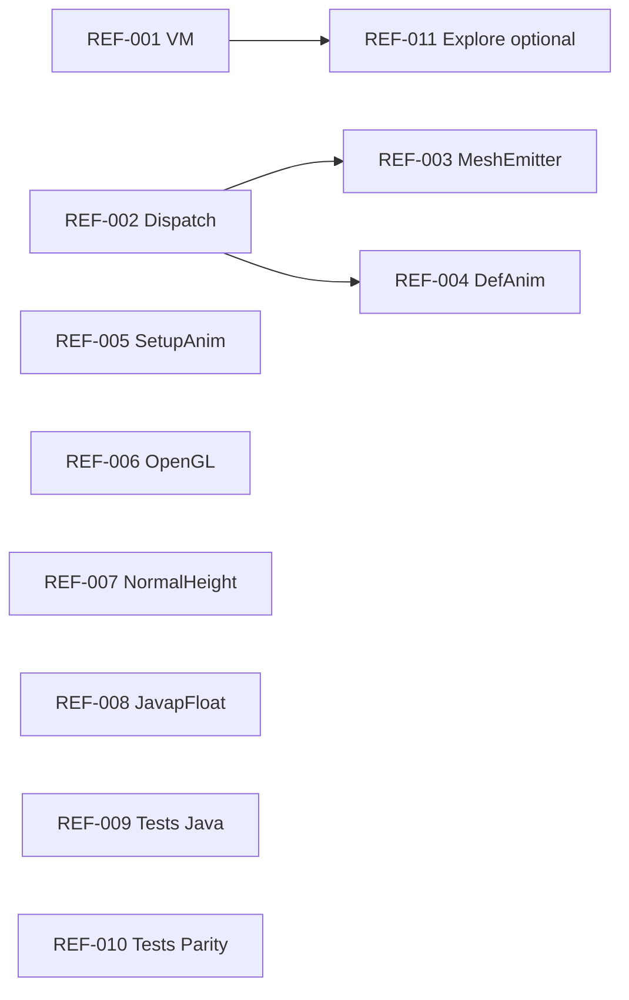

# Large-class split refactor plan (multi-agent)

**Status:** Draft — ready for parallel agent tasks  
**Created:** 2026-05-22 (line-count audit of `src/` + `tests/`)  
**Goal:** Improve AI context readability, IDE navigation, and compile-time locality **without** behavior changes.  
**Related:** [`runtime-ir-preview-plan.md`](runtime-ir-preview-plan.md), [`test-guidance-geometry-animation-ir.md`](test-guidance-geometry-animation-ir.md), [`vanilla-preview-parity.md`](vanilla-preview-parity.md)

---

## Core principles (read first)

1. **Mechanical moves only** — same types, same method bodies, same branch order unless a separate design task explicitly changes semantics.
2. **No behavior PRs mixed with splits** — one agent task = file moves / `partial` extraction / test fixture moves. Bug fixes are a different PR.
3. **Order-sensitive code stays order-stable** — especially `CleanRoomEntityDispatch` GPU bone slots (`EntityGpuBoneDispatchKind.SpecificModelSlot`). Run routing inventory tests after every dispatch touch.
4. **Prefer `partial` over new public types** when splitting classes already marked `partial` or when callers should not change.
5. **Prefer extraction to existing coordinators** when a domain already has one (`ExploreTreeController` pattern).
6. **Generated code** (`.g.cs`, compiler outputs) — do not hand-split; shrink inputs or improve codegen instead.
7. **Verify every task** with targeted `dotnet test` (see per-task commands). Full solution test is optional unless the task touches shared contracts.

### Agent workflow (each task)

```text
1. Claim task ID (update Status table below or PR title: [REF-00N])
2. Read "Scope" + "Do not" + "Verification"
3. Create branch OR worktree if parallel with sibling tasks (see Parallel groups)
4. Apply mechanical split only
5. dotnet build + listed tests
6. PR description: list new files, assert zero logic diff (optional: git diff -w --ignore-blank-lines)
```

### Parallel groups (safe concurrent work)

| Group | Tasks | Conflict risk |
|-------|-------|---------------|
| **A — App shell** | REF-001 | Low (isolated under `AutoPBR.App/ViewModels/`) |
| **B — Preview entity runtime** | REF-002, REF-003, REF-004 | **High** — same `CleanRoomEntityModelRuntime` partial type; **serialize** or use one agent |
| **C — Tools / GL** | REF-005, REF-006 | Low (different projects) |
| **D — Core generators** | REF-007 | Low |
| **E — Geometry compiler** | REF-008 | Medium (many partials, one class) |
| **F — Tests** | REF-009, REF-010 | Low (test projects only) |

**Rule:** Never assign REF-002 + REF-003 + REF-004 to three agents on the same branch without coordination.

---

## Baseline metrics (2026-05-22)

Production `src/` (hand-written `.cs`, excludes `obj`/`bin`):

| Lines | Path | Notes |
|------:|------|-------|
| 3288 | `src/AutoPBR.App/ViewModels/MainWindowViewModel.cs` | Single file; ~160 `[ObservableProperty]`, ~14 `[RelayCommand]` |
| 2540 | `src/AutoPBR.Core/Preview/Entities/CleanRoomEntityDispatch.cs` | Dispatch / `TryBuildSpecific` ladder |
| 2280 | `src/AutoPBR.Tools.AnimationCompiler/SetupAnimLift.cs` | Static; ~80 methods |
| 2248 | `src/AutoPBR.App/Rendering/OpenGL/OpenGlPreviewBackend.cs` | No partials today |
| 2048 | `src/AutoPBR.Tools.GeometryCompiler/JavapFloatGeometryMeshLift.cs` | Main shard of 4473 total (7 partials) |
| 1842 | `src/AutoPBR.App/Services/ExploreTreeController.cs` | Already extracted from VM |
| 1610 | `src/AutoPBR.Core/Preview/GeometryIrMeshEmitter.cs` | `partial` CleanRoomEntityModelRuntime |
| 1372 | `src/AutoPBR.Core/NormalHeightGenerator.cs` | Static pipeline |
| 1314 | `src/AutoPBR.Core/Preview/Entities/CleanRoomEntityGeometryIrDefinitionAnimation.cs` | Definition-animation IR |
| 1230 | `src/AutoPBR.Core/Preview/GeometryJavapPoseOracle.cs` | Oracle tables |

Aggregates:

| Aggregate | Total lines | Files |
|-----------|------------:|------:|
| `CleanRoomEntity*` | ~13,916 | 22 |
| `JavapFloatGeometryMeshLift*` | ~4,473 | 7 |

Tests (AI context — split when touching parity):

| Lines | Path |
|------:|------|
| 4516 | `tests/AutoPBR.Core.Tests/MinecraftJavaModelPreviewTests.cs` |
| 3267 | `tests/AutoPBR.Core.Tests/EntityTextureParityCatalogTests.cs` |

---

## Task status

| ID | Title | Priority | Status | Owner / PR |
|----|-------|----------|--------|------------|
| REF-001 | MainWindowViewModel partials | P0 | `todo` | |
| REF-002 | CleanRoomEntityDispatch shards | P0 | `todo` | |
| REF-003 | GeometryIrMeshEmitter shards | P1 | `todo` | |
| REF-004 | CleanRoomEntityGeometryIrDefinitionAnimation split | P1 | `todo` | |
| REF-005 | SetupAnimLift partials | P1 | `todo` | |
| REF-006 | OpenGlPreviewBackend partials | P1 | `todo` | |
| REF-007 | NormalHeightGenerator split | P2 | `todo` | |
| REF-008 | JavapFloatGeometryMeshLift main-file trim | P2 | `todo` | |
| REF-009 | MinecraftJavaModelPreviewTests fixture split | P2 | `done` | |
| REF-010 | EntityTextureParityCatalogTests fixture split | P2 | `done` | |
| REF-011 | ExploreTreeController partials (optional) | P3 | `todo` | |

---

## REF-001 — MainWindowViewModel partials (P0)

**Problem:** One ~3.3k-line file holds settings, explore delegation, scan/convert, 2D/3D preview, tag rules, and background-task UI.

**Outcome:** Same `public partial class MainWindowViewModel`; no new public surface required.

### Target files

| File | Move here (indicative) |
|------|-------------------------|
| `MainWindowViewModel.cs` | ctor, core fields, `IDisposable`, shared helpers (`AddLogLine`, `RunOnUiThread`, `SetStatus`) |
| `MainWindowViewModel.Settings.cs` | `SaveSettings`, culture/options refresh, color scheme, UI scale, ML option lists, `UserSettings` sync handlers |
| `MainWindowViewModel.Preview.cs` | GL registration, 3D debounce, `PreviewDisplayMode`, texture maps, mesh provenance logging, camera pose timer |
| `MainWindowViewModel.ScanConvert.cs` | `ScanArchiveAsync`, batch scan, `ConvertAsync`, `Cancel`, background sink (`IBackgroundTaskSink`) |
| `MainWindowViewModel.Explore.cs` | Explore commands delegating to `ExploreTreeController` (breadcrumb, expand/collapse, go back) |
| `MainWindowViewModel.TagRules.cs` | Tag overrides, `NotifyTagRulesChanged`, semantic debug command |

Use `#region` only if needed for navigation inside a partial; prefer file boundaries over regions.

### Do not

- Change command names, `CanExecute` logic, or binding property names.
- Move logic out of `ExploreTreeController` in this task (that's REF-011).

### Verification

```bash
dotnet build src/AutoPBR.App/AutoPBR.App.csproj
dotnet test tests/AutoPBR.App.Tests/AutoPBR.App.Tests.csproj --filter "FullyQualifiedName~Preview"
```

Manual smoke (document in PR): launch app, scan pack, set preview, convert cancel.

### Acceptance

- [ ] Each new partial &lt; ~900 lines
- [ ] `MainWindowViewModel.cs` &lt; ~800 lines
- [ ] Solution builds; App tests green

---

## REF-002 — CleanRoomEntityDispatch shards (P0)

**Problem:** Single ~2.5k-line dispatch ladder; branch order maps to GPU bone slots.

**Outcome:** Multiple `partial` files; **identical** branch order and conditions.

### Target files

| File | Contents |
|------|----------|
| `CleanRoomEntityDispatch.cs` | `TryDispatchEntityStaticMeshBuild` entry, shared guards, small helpers |
| `CleanRoomEntityDispatch.ParityCatalog.cs` | Parity catalog + Geometry IR fast path blocks |
| `CleanRoomEntityDispatch.SpecificSlots.cs` | `TryBuildSpecific` branches (copy blocks verbatim in order) |

Optional later (out of scope for REF-002): table-driven dispatch codegen from `EntityTextureParityCatalog`.

### Do not

- Reorder `if` / `else if` branches in `TryBuildSpecific`
- Rename `EntityGpuBoneDispatchRoute` slot indices
- Mix behavior fixes (reparent policy, new builders) into split PR

### Verification

```bash
dotnet test tests/AutoPBR.Core.Tests/AutoPBR.Core.Tests.csproj --filter "FullyQualifiedName~EntityTextureRoutingInventory"
dotnet test tests/AutoPBR.Core.Tests/AutoPBR.Core.Tests.csproj --filter "FullyQualifiedName~CleanRoomEntityRuntime"
dotnet test tests/AutoPBR.Core.Tests/AutoPBR.Core.Tests.csproj --filter "FullyQualifiedName~EntityTextureParity"
```

### Acceptance

- [ ] No diff in branch sequence (reviewers: use diff tool with move detection)
- [ ] Routing inventory tests pass
- [ ] Each shard &lt; ~1200 lines

---

## REF-003 — GeometryIrMeshEmitter shards (P1)

**Problem:** ~1.6k lines in one `partial` on `CleanRoomEntityModelRuntime`.

### Target files

| File | Contents |
|------|----------|
| `GeometryIrMeshEmitter.cs` | `TryEmitGeometryIrBodyLayer`, walk entry, shared constants |
| `GeometryIrMeshEmitter.PoseCompose.cs` | `TryComposePartPose*`, matrix compose helpers |
| `GeometryIrMeshEmitter.EmitPresets.cs` | Preset-specific emit paths (align naming with `GeometryIrMeshEmitPresets.cs` — avoid duplicate preset tables) |

**Depends on:** REF-002 complete or rebased (same partial class).

### Verification

```bash
dotnet test tests/AutoPBR.Core.Tests/AutoPBR.Core.Tests.csproj --filter "FullyQualifiedName~GeometryIr"
dotnet test tests/AutoPBR.Core.Tests/AutoPBR.Core.Tests.csproj --filter "FullyQualifiedName~CleanRoomEntityRuntime"
```

### Acceptance

- [ ] No public API changes on `CleanRoomEntityModelRuntime`
- [ ] Geometry IR mesh / assembly tests green

---

## REF-004 — Definition-animation partial split (P1)

**Problem:** `CleanRoomEntityGeometryIrDefinitionAnimation.cs` ~1.3k lines; pattern exists (`*.Breeze.cs`).

### Target files

- Keep shared sampling entry in `CleanRoomEntityGeometryIrDefinitionAnimation.cs`
- Add one partial per **animation family** or per **builder_method group** (mirror `CleanRoomEntityMonsters` / `Quadrupeds` taxonomy)
- Example: `CleanRoomEntityGeometryIrDefinitionAnimation.Warden.cs` (only if block is &gt; ~200 lines)

### Do not

- Change `DefinitionAnimationPreviewSampling` channel policy in split PR

### Verification

```bash
dotnet test tests/AutoPBR.Core.Tests/AutoPBR.Core.Tests.csproj --filter "FullyQualifiedName~DefinitionAnimation"
dotnet test tests/AutoPBR.Core.Tests/AutoPBR.Core.Tests.csproj --filter "FullyQualifiedName~VanillaAnimationIr"
```

### Acceptance

- [ ] Base file &lt; ~400 lines
- [ ] Each new partial &lt; ~500 lines

---

## REF-005 — SetupAnimLift partials (P1)

**Problem:** ~2.3k-line static class in AnimationCompiler.

### Target files

| File | Contents |
|------|----------|
| `SetupAnimLift.cs` | Public entry points, `IsNonBlockingNote`, shared regex fields |
| `SetupAnimLift.Parse.cs` | Javap line parsing, field/method resolution |
| `SetupAnimLift.Expressions.cs` | Assignment / expression lifting |
| `SetupAnimLift.Hoist.cs` | Abstract inheritance hoists |
| `SetupAnimLift.Emit.cs` | JSON shard writers |

Use `internal static partial class SetupAnimLift` (add `partial` keyword to existing class).

### Verification

```bash
dotnet test tests/AutoPBR.AnimationCompiler.Tests/AutoPBR.AnimationCompiler.Tests.csproj
```

### Acceptance

- [ ] All shards compile as `partial` of one class
- [ ] AnimationCompiler tests unchanged (green)

---

## REF-006 — OpenGlPreviewBackend partials (P1)

**Problem:** ~2.2k-line sealed GL backend.

### Target files

| File | Contents |
|------|----------|
| `OpenGlPreviewBackend.cs` | `IRenderPreviewBackend` impl surface, fields, ctor/dispose |
| `OpenGlPreviewBackend.Lifecycle.cs` | Texture upload, mesh buffer (re)build |
| `OpenGlPreviewBackend.Shaders.cs` | Program compile / link |
| `OpenGlPreviewBackend.SceneDraw.cs` | Grid, axes, ground, main mesh draw |
| `OpenGlPreviewBackend.Lighting.cs` | Shadow map, sun, atmosphere passes |

Use `public sealed partial class OpenGlPreviewBackend`.

### Verification

```bash
dotnet build src/AutoPBR.App/AutoPBR.App.csproj
dotnet test tests/AutoPBR.App.Tests/AutoPBR.App.Tests.csproj --filter "FullyQualifiedName~Preview"
```

### Acceptance

- [ ] No changes to `IRenderPreviewBackend` contract
- [ ] Preview rendering tests green

---

## REF-007 — NormalHeightGenerator split (P2)

**Problem:** Classical operators + DeepBump ONNX + orchestration in one static class.

### Target files

| File | Contents |
|------|----------|
| `NormalHeightGenerator.cs` | `GenerateAsync`, progress, texture loop |
| `NormalHeightGenerator.Classical.cs` | Sobel / kernel / VC orientation paths |
| `NormalHeightGenerator.DeepBump.cs` | ONNX session, fallback activation |

### Verification

```bash
dotnet test tests/AutoPBR.Core.Tests/AutoPBR.Core.Tests.csproj --filter "FullyQualifiedName~BrickHeight|FullyQualifiedName~Normal"
```

---

## REF-008 — JavapFloatGeometryMeshLift main-file trim (P2)

**Problem:** Main shard ~2048 lines; total type ~4473 across 7 partials.

### Action

- Move remaining pipeline stages from `JavapFloatGeometryMeshLift.cs` into existing partials **or** add:
  - `JavapFloatGeometryMeshLift.Orchestration.cs` (entry only)
- Leave `JavapFloatGeometryMeshLift.cs` as thin coordinator (&lt; ~600 lines target)

### Do not

- Change lift diagnostics JSON shape in split PR

### Verification

```bash
dotnet test tests/AutoPBR.GeometryCompiler.Tests/AutoPBR.GeometryCompiler.Tests.csproj
```

---

## REF-009 — MinecraftJavaModelPreviewTests split (P2)

**Problem:** ~4.5k-line test fixture; hurts agent retrieval.

### Target layout (suggested)

| File | Test name prefix / theme |
|------|---------------------------|
| `MinecraftJavaModelPreviewTests.BlockstateBake.cs` | `ModelNotation*`, `TryBake*`, `MapTexture*`, zip merge |
| `MinecraftJavaModelPreviewTests.CleanRoomEntity.cs` | `CleanRoomEntityRuntime_*` |
| `MinecraftJavaModelPreviewTests.GeometryIr.cs` | Geometry IR / assembly viewport (if present) |

Keep **one test class name per file** or use `partial class MinecraftJavaModelPreviewTests` in test project (supported in xUnit).

### Verification

```bash
dotnet test tests/AutoPBR.Core.Tests/AutoPBR.Core.Tests.csproj --filter "FullyQualifiedName~MinecraftJavaModelPreviewTests"
```

### Acceptance

- [ ] No test renames (only file moves) unless fixing duplicates
- [ ] Same test count before/after

---

## REF-010 — EntityTextureParityCatalogTests split (P2)

**Problem:** ~3.3k-line parity catalog tests.

### Target layout

Split by **entity family** or **builder_method** prefix (match `CleanRoomEntity*` taxonomy):

- `EntityTextureParityCatalogTests.Humanoids.cs`
- `EntityTextureParityCatalogTests.Quadrupeds.cs`
- `EntityTextureParityCatalogTests.Monsters.cs`
- … etc.

Shared fixtures → `EntityTextureParityCatalogTests.Fixtures.cs` (static helpers only).

### Verification

```bash
dotnet test tests/AutoPBR.Core.Tests/AutoPBR.Core.Tests.csproj --filter "FullyQualifiedName~EntityTextureParityCatalog"
```

---

## REF-011 — ExploreTreeController partials (P3, optional)

**Problem:** ~1.8k lines; already better than monolithic VM.

### Target files

- `ExploreTreeController.TreeBuild.cs`
- `ExploreTreeController.Tags.cs`
- `ExploreTreeController.BatchUi.cs`

Low priority until REF-001 done (avoid two agents refactoring App explore stack at once).

---

## Explicit non-goals (this plan)

| Item | Reason |
|------|--------|
| Split `CleanRoomEntityQuadrupeds.cs` etc. | Already family-scoped; diminishing returns |
| Split `GeometryIrEntityCuboidTables.g.cs` | Generated |
| Reorder dispatch branches | Behavior change — separate design + inventory tests |
| Table-driven dispatch codegen | Future task; depends on REF-002 stable shards |
| Merge small partials (&lt;300 lines) | Increases navigation cost |

---

## Recommended execution order



**Suggested PR sequence for minimal merge pain:**

1. REF-001  
2. REF-005 + REF-006 (parallel, different projects)  
3. REF-002 → REF-003 → REF-004 (serial on `CleanRoomEntityModelRuntime`)  
4. REF-009 + REF-010 (parallel)  
5. REF-007, REF-008, REF-011 as capacity allows  

---

## PR template (copy per task)

```markdown
## [REF-00N] <title>

Mechanical split only — no intentional behavior change.

### Files added
- ...

### Line counts (approx)
| File | Lines |
|------|------:|

### Verification
- [ ] `dotnet build` …
- [ ] `dotnet test` …

### Risk notes
- ...

### Agent checklist
- [ ] Branch order unchanged (if dispatch)
- [ ] No new public API without approval
```

---

## Appendix — file paths quick reference

```text
src/AutoPBR.App/ViewModels/MainWindowViewModel*.cs
src/AutoPBR.App/Rendering/OpenGL/OpenGlPreviewBackend*.cs
src/AutoPBR.App/Services/ExploreTreeController*.cs
src/AutoPBR.Core/Preview/Entities/CleanRoomEntity*.cs
src/AutoPBR.Core/Preview/GeometryIrMeshEmitter*.cs
src/AutoPBR.Core/NormalHeightGenerator*.cs
src/AutoPBR.Tools.AnimationCompiler/SetupAnimLift*.cs
src/AutoPBR.Tools.GeometryCompiler/JavapFloatGeometryMeshLift*.cs
tests/AutoPBR.Core.Tests/MinecraftJavaModelPreviewTests*.cs
tests/AutoPBR.Core.Tests/EntityTextureParityCatalogTests*.cs
```

**Re-baseline line counts after each merged PR:**

```powershell
Get-ChildItem -Path "src" -Recurse -Include *.cs -File |
  Where-Object { $_.FullName -notmatch '\\(obj|bin)\\' } |
  ForEach-Object {
    $lines = (Get-Content $_.FullName | Measure-Object -Line).Lines
    [PSCustomObject]@{ Lines = $lines; Path = $_.FullName.Replace((Get-Location).Path + '\', '') }
  } | Sort-Object Lines -Descending | Select-Object -First 25
```
